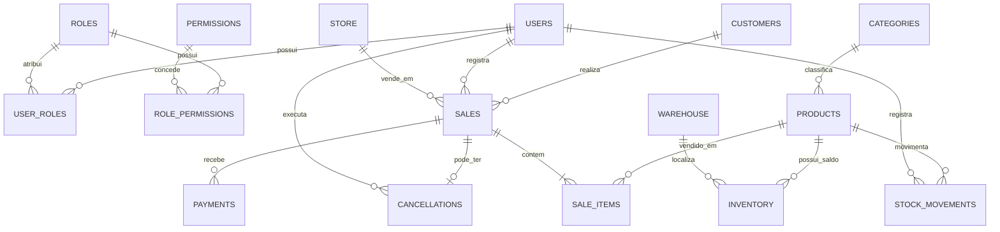

# SystemCommerce-api — Arquitetura

Documento vivo da arquitetura. Detalhes operacionais: pasta [docs/](./docs/).

## 1. Visão geral

O **SystemCommerce-api** é o backend REST do ERP de gestão comercial SystemCommerce.  
É um projeto **totalmente independente** do frontend (`SystemCommerce-front`).

### Responsabilidades exclusivas da API

- Autenticação e autorização (JWT + perfis + permissões)
- Todas as regras de negócio
- Persistência e integridade dos dados
- Cálculo de preços, totais e descontos
- Validação e movimentação de estoque
- Alteração de status, cancelamentos e auditoria
- Relatórios e agregações do dashboard
- Operações de PDV (caixa, autorização comercial/financeira, totais oficiais da venda no balcão)
- Emissão e gestão de documentos fiscais eletrônicos (NF-e/NFC-e): tributação, assinatura, transmissão SEFAZ, XML, eventos e DANFE

### O que a API **não** faz

- Renderização de UI
- Validação “só de UX” (máscaras, etc.) — o frontend cuida disso; a API **sempre** revalida
- Acesso direto ao banco por outros sistemas (somente esta API acessa o PostgreSQL)
- Exposição de certificado digital, senha de certificado ou fórmulas tributárias oficiais ao frontend

### Stack obrigatória

| Tecnologia | Uso |
|---|---|
| Java 21 | Runtime |
| Spring Boot | Framework |
| Spring Web | API REST |
| Spring Data JPA | Persistência |
| Spring Security + JWT | Segurança |
| PostgreSQL | Banco de dados |
| Flyway | Migrations |
| Bean Validation | Validação de entrada |
| OpenAPI/Swagger | Documentação de endpoints |
| Maven | Build |
| JUnit 5 + Mockito + Testcontainers | Testes |

---

## 2. Princípios arquiteturais

1. **Dois projetos independentes** — sem dependência de código, build ou runtime entre API e front.
2. **Regras de negócio só no backend.**
3. **API-first** — contrato REST documentado via OpenAPI.
4. **Arquitetura modular por domínio** — cada módulo encapsula controller, service, repository, entity, DTO e regras.
5. **Entidades JPA nunca expostas** nos controllers — apenas DTOs de entrada/saída.
6. **UUID** como identificador principal.
7. **BigDecimal** para valores monetários.
8. **UTC** para datas/horários persistidos.
9. **Soft delete / registro ativo** quando aplicável.
10. **Flyway** como única fonte de verdade do schema (`ddl-auto=validate` ou `none` em produção; **nunca** `create`/`update`).
11. **BCrypt** para senhas — nunca texto puro.
12. **Paginação** em todas as listagens.
13. **Tratamento global de exceções**.

---

## 3. Divisão de módulos

| Módulo | Responsabilidade |
|---|---|
| `auth` | Login, refresh (se aplicável), emissão/validação de JWT |
| `users` | Cadastro e gestão de usuários |
| `roles` | Perfis (ex.: ADMIN, VENDEDOR, ESTOQUISTA) |
| `permissions` | Permissões granulares e vínculo perfil↔permissão |
| `customers` | Clientes (PF/PJ) |
| `categories` | Categorias de produtos |
| `products` | Produtos e preços base |
| `inventory` | Saldo de estoque por produto |
| `stock-movements` | Entradas, saídas, ajustes |
| `sales` | Vendas e ciclo de vida (status) |
| `sale-items` | Itens da venda (parte do domínio `sales`) |
| `payments` | Pagamentos vinculados à venda |
| `cancellations` | Cancelamento de vendas e efeitos colaterais |
| `dashboard` | Indicadores agregados |
| `reports` | Relatórios básicos |
| `pos` / `cash` | Lojas, terminais, sessão de caixa, sangria/suprimento, impressão — ver [PDV_ARCHITECTURE.md](../docs/PDV_ARCHITECTURE.md) |
| `organization` / multilojas | Organização + lojas (57); profissionais/lotação (58); acesso/transferência nos prompts seguintes — [MULTISTORE_ARCHITECTURE.md](../docs/MULTISTORE_ARCHITECTURE.md) |
| `employee` | Profissionais e `EmployeeStoreAssignment` — distinto de `User` |
| `supplier` / `purchase` | Fornecedores e cadeia de compras — [PURCHASE_ARCHITECTURE.md](./docs/PURCHASE_ARCHITECTURE.md) |
| `quote` / `salesorder` / `sale` | Orçamento, pedido e venda — [SALES_ARCHITECTURE.md](./docs/SALES_ARCHITECTURE.md) |
| `inventory` | Saldos e movimentações — [INVENTORY_ARCHITECTURE.md](./docs/INVENTORY_ARCHITECTURE.md) |
| `finance` | Contas, AP/AR, liquidez, conciliação — [FINANCE_ARCHITECTURE.md](./docs/FINANCE_ARCHITECTURE.md) |
| `fiscal` | NF-e (55), NFC-e (65), tributação, SEFAZ, XML, eventos — [FISCAL_ARCHITECTURE.md](./docs/FISCAL_ARCHITECTURE.md) |
| `shared` / `common` | Auditoria base, exceções, paginação, segurança transversal |

### Evolução ERP profissional (Prompts 56–90)

Revisão arquitetural da cadeia comercial: [ERP_COMMERCIAL_ARCHITECTURE.md](./docs/ERP_COMMERCIAL_ARCHITECTURE.md), rastreabilidade [DOCUMENT_TRACEABILITY.md](./docs/DOCUMENT_TRACEABILITY.md).  
**Nota:** a numeração “Prompt 56” desta série **não** é a mesma do Prompt 56 multiloja (`MULTISTORE_ARCHITECTURE`).

### Módulo fiscal (Prompts 121+)

Camada especializada integrada ao comercial/PDV/estoque/financeiro **sem** recriar vendas, pagamentos ou movimentações.  
Índice: [FISCAL_ARCHITECTURE.md](./docs/FISCAL_ARCHITECTURE.md) · [FISCAL_INTEGRATION.md](./docs/FISCAL_INTEGRATION.md) · [NFE_ARCHITECTURE.md](./docs/NFE_ARCHITECTURE.md) · [NFCE_ARCHITECTURE.md](./docs/NFCE_ARCHITECTURE.md) · [FISCAL_SECURITY.md](./docs/FISCAL_SECURITY.md) · [FISCAL_CONTINGENCY.md](./docs/FISCAL_CONTINGENCY.md) · [FISCAL_VERSIONING.md](./docs/FISCAL_VERSIONING.md) · [FISCAL_TRACEABILITY.md](./docs/FISCAL_TRACEABILITY.md).

### Dependências entre módulos (direção permitida)

```
auth → users, roles, permissions
sales → customers, products, inventory, stock-movements, payments, cancellations
stock-movements → products, inventory
pos / cash → sales, payments, inventory (orquestra; não duplica totais/estoque)
finance → sales, purchase, pos (gera títulos; nunca escreve estoque)
fiscal → sale, salesorder, purchase, product, store, customer, supplier, carrier
         (emite DFe; nunca escreve estoque nem títulos financeiros)
dashboard / reports → sales, products, inventory, customers, pos, finance, fiscal (leitura)
```

Módulos de cadastro (`customers`, `categories`, `products`) não devem depender de `sales`.

**PDV:** não cria `PosSale` / `PosPayment`. Venda de balcão = `Sale` com `channel = POS` + `CashSession`. Detalhes: [`docs/PDV_ARCHITECTURE.md`](../docs/PDV_ARCHITECTURE.md).

**Multiloja (Prompt 56):** uma base PostgreSQL; isolamento lógico por organização, loja e depósito. Contrato: [`docs/MULTISTORE_ARCHITECTURE.md`](../docs/MULTISTORE_ARCHITECTURE.md).  
`User` = credencial; `Employee` = profissional (modelo alvo). Sem banco/schema por loja.

**Fiscal:** `FiscalDocument` referencia `Sale`/`PurchaseReceipt`; adapters SEFAZ por UF; leiautes versionados (MOC/NT/Reforma). Certificado e regras tributárias só no backend.

---

## 4. Modelo inicial de entidades e relacionamentos

### 4.1 Diagrama lógico (Mermaid)

Diagrama **histórico** do ERP (núcleo). Modelo multilojas completo (Organization, Employee, UserStoreAccess, StoreProduct, etc.): [`docs/MULTISTORE_ARCHITECTURE.md`](../docs/MULTISTORE_ARCHITECTURE.md) §4.



### 4.2 Entidades e campos base (auditoria comum)

Todas as tabelas de negócio, quando aplicável, devem possuir:

| Campo | Tipo | Observação |
|---|---|---|
| `id` | UUID | PK |
| `created_at` | timestamptz | UTC |
| `updated_at` | timestamptz | UTC |
| `created_by` | UUID (nullable) | FK lógica para `users` |
| `updated_by` | UUID (nullable) | FK lógica para `users` |
| `active` | boolean | soft delete / registro ativo |

### 4.3 Catálogo de entidades (modelo inicial)

#### `users`
- `id`, `name`, `email` (unique), `password_hash` (BCrypt)
- `active`, auditoria
- Relacionamento N:N com `roles` via `user_roles`

#### `roles`
- `id`, `code` (unique, ex.: `ADMIN`), `name`, `description`
- `active`, auditoria

#### `permissions`
- `id`, `code` (unique, ex.: `PRODUCT_CREATE`), `name`, `module`
- `active`, auditoria

#### `role_permissions`
- `role_id`, `permission_id` (PK composta ou UUID próprio + unique pair)

#### `user_roles`
- `user_id`, `role_id`

#### `customers`
- `id`, `type` (PF/PJ), `name`, `document` (CPF/CNPJ unique), `email`, `phone`
- endereço: `zip_code`, `street`, `number`, `complement`, `district`, `city`, `state`
- `active`, auditoria

#### `categories`
- `id`, `name` (unique), `description`
- `active`, auditoria

#### `products`
- `id`, `sku` (unique), `name`, `description`
- `category_id` (FK)
- `unit_price` (BigDecimal), `cost_price` (BigDecimal, opcional)
- `active`, auditoria

#### `inventory`
- `id`, unique `(product_id, warehouse_id)` — saldo por depósito
- `quantity` (BigDecimal), `minimum_quantity` (alerta)
- auditoria
- Estoque “da loja” = soma dos depósitos da loja (API). Ver [PDV_ARCHITECTURE.md](../docs/PDV_ARCHITECTURE.md) e [MULTISTORE_ARCHITECTURE.md](../docs/MULTISTORE_ARCHITECTURE.md)

#### `stock_movements`
- `id`, `product_id`, `type` (IN, OUT, ADJUSTMENT)
- `quantity`, `previous_quantity`, `new_quantity`
- `reference_type` / `reference_id` (ex.: SALE, MANUAL)
- `reason`, `user_id`
- `created_at` (imutável após criação — movimentações não se editam; cancelamento gera movimento compensatório)

#### `sales`
- `id`, `customer_id` (nullable em draft; no PDV pode permanecer consumidor não identificado conforme regra)
- `seller_id` (hoje `User`; **alvo multilojas:** vendedor = `Employee`, registrante = `User`)
- `store_id` — loja da venda (obrigatório no modelo multilojas)
- `status` (DRAFT, SUSPENDED, CONFIRMED, PARTIALLY_PAID, PAID, CANCELLED)
- `channel` (ADMIN | POS) — extensão PDV
- `cash_session_id`, `sales_terminal_id` — extensão PDV (nullable no backoffice)
- `subtotal`, `discount_amount`, `surcharge_amount`, `freight_amount`, `total_amount` (**sempre calculados no backend**)
- `notes`
- `active` / auditoria
- **Não** existe entidade `PosSale` separada

#### `sale_items`
- `id`, `sale_id`, `product_id`
- `quantity`, `unit_price`, `discount_amount`, `line_total`
- Preços e totais **calculados/validados na API** no momento da inclusão/confirmação

#### `payments`
- `id`, `sale_id`
- `cash_session_id` (nullable; obrigatório em fluxo POS)
- `method` (CASH, PIX, CARD, …)
- `amount`, `tendered_amount`, `paid_at`, `status`
- auditoria
- **Não** existe entidade `PosPayment` separada

#### `cancellations`
- `id`, `sale_id` (unique)
- `reason`, `cancelled_by`, `cancelled_at`
- Efeitos: estorno de estoque e invalidação/ajuste de pagamentos — **regra na API**

---

## 5. Fluxos principais

### 5.1 Autenticação (JWT)

```
Cliente → POST /api/v1/auth/login { email, password }
       → API valida credenciais (BCrypt) do User
       → Carrega roles/permissions + (alvo) organizationId, lojas UserStoreAccess, Employee vinculado
       → Gera access token JWT (claims: sub=userId, roles/permissions; alvo: organizationId)
       → Retorna token + dados mínimos + lojas autorizadas
Cliente → Seleciona loja ativa (contexto validado na API) — ver MULTISTORE_ARCHITECTURE §5.2
Cliente → Requests com Authorization: Bearer <token> (+ store context)
       → Filtro JWT valida assinatura/expiração; services revalidam escopo de loja
```

- Senha nunca retornada em DTOs.
- Tokens com expiração configurável via `.env`.
- `User` ≠ `Employee`: login autentica a **credencial**; o profissional é entidade aparte (modelo alvo).

### 5.2 Autorização (perfil + permissão + escopo de loja)

1. Usuário possui um ou mais **roles**.
2. Cada role possui um conjunto de **permissions** (`CODE` estável).
3. Endpoints protegidos com `@PreAuthorize("hasAuthority('PRODUCT_CREATE')")` (ou equivalente).
4. Roles compostas agregam permissions; a API avalia **permission**, não só role genérica, nos endpoints sensíveis.
5. Seeds iniciais: perfil `ADMIN` com todas as permissions; demais perfis com subconjuntos.
6. **Multiloja (alvo):** após a permissão funcional, validar `organization` → `UserStoreAccess` → lotação/atuação temporária → terminal/depósito coerentes. Detalhe: [`MULTISTORE_ARCHITECTURE.md`](../docs/MULTISTORE_ARCHITECTURE.md) §6.

### 5.3 Fluxo principal de vendas

```
1. Criar venda (DRAFT) com customer_id
2. Adicionar/atualizar/remover itens
   - API busca preço do produto (ou valida preço informado contra regras)
   - Calcula line_total, subtotal, descontos e total
   - Valida produto ativo e regras de cadastro
3. Confirmar venda (CONFIRMED)
   - Valida estoque disponível
   - Gera stock_movements tipo OUT
   - Atualiza inventory
4. Registrar pagamento(s)
   - Valida soma vs total
   - Atualiza status (ex.: PAID quando quitada)
5. Cancelamento (quando permitido pelo status)
   - Registra cancellation
   - Movimentos compensatórios de estoque
   - Ajusta status para CANCELLED
```

**Frontend apenas orquestra chamadas e exibe confirmações; não calcula totais finais nem libera estoque.**

### 5.4 Fluxo de movimentação de estoque

```
Entrada manual / compra / ajuste positivo
  → stock_movements (IN ou ADJUSTMENT+)
  → inventory.quantity aumenta

Saída por venda
  → disparada pelo domínio sales na confirmação
  → stock_movements (OUT, reference=SALE)
  → inventory.quantity diminui (com validação de saldo)

Cancelamento de venda
  → stock_movements compensatório (IN)
  → inventory restaurado
```

Movimentações são **append-only**. Correções = novos movimentos, nunca update destrutivo do histórico.

---

## 6. Estratégia de auditoria

| Mecanismo | Descrição |
|---|---|
| Colunas de auditoria | `created_at`, `updated_at`, `created_by`, `updated_by` |
| Preenchimento | `@EntityListeners` / `AuditorAware` com usuário do SecurityContext |
| Soft delete | `active=false` (ou `deleted_at`) — listagens padrão filtram ativos |
| Histórico de estoque | tabela `stock_movements` como trilha imutável |
| Cancelamentos | entidade dedicada com motivo e responsável |

---

## 7. Migrations e seeds (Flyway)

### Estrutura

```
src/main/resources/db/migration/
  V1__create_users_roles_permissions.sql
  V2__create_customers.sql
  V3__create_categories_products.sql
  V4__create_inventory_stock_movements.sql
  V5__create_sales_payments_cancellations.sql
  ...
src/main/resources/db/seed/          # ou migrations V100+ / profiles
  R__seed_permissions.sql            # repeatable, se adotado
```

### Regras

- Toda alteração de schema **somente** via Flyway.
- Produção: `spring.jpa.hibernate.ddl-auto=validate` (ou `none`).
- Constraints, FKs e índices definidos nas migrations.
- Cada módulo possui **seeds iniciais** para testes (usuário admin, roles, permissions, categorias/produtos de exemplo).
- Seeds de desenvolvimento/teste isolados por profile (`dev`, `test`) para não poluir produção sem controle.

---

## 8. Estratégia de testes

| Camada | Ferramentas | Foco |
|---|---|---|
| Unitário | JUnit 5 + Mockito | Services, regras de preço/estoque/status |
| Integração | Spring Boot Test + Testcontainers (PostgreSQL) | Repositories, migrations, fluxos REST |
| Segurança | `@WithMockUser` / tokens de teste | Autorização por permission |
| Contrato | testes dos controllers + OpenAPI atualizado | DTOs e status HTTP |

Critérios por etapa: compilação OK, testes verdes, migrations válidas, endpoints documentados.

---

## 9. Padrão de respostas da API

### Sucesso (recurso único)

```json
{
  "data": { },
  "timestamp": "2026-07-17T22:00:00Z"
}
```

### Sucesso (lista paginada)

```json
{
  "data": [ ],
  "page": {
    "number": 0,
    "size": 20,
    "totalElements": 100,
    "totalPages": 5
  },
  "timestamp": "2026-07-17T22:00:00Z"
}
```

### Erro (padrão global)

```json
{
  "timestamp": "2026-07-17T22:00:00Z",
  "status": 400,
  "error": "Bad Request",
  "message": "Resumo legível",
  "path": "/api/v1/products",
  "details": [
    { "field": "sku", "message": "já está em uso" }
  ]
}
```

### Convenções HTTP

| Situação | Status |
|---|---|
| Criado | 201 |
| OK | 200 |
| Sem conteúdo | 204 |
| Validação | 400 |
| Não autenticado | 401 |
| Sem permissão | 403 |
| Não encontrado | 404 |
| Conflito de regra/negócio | 409 |
| Erro interno | 500 |

Base path sugerido: `/api/v1`.

---

## 10. Tratamento de erros

- `@ControllerAdvice` / `@RestControllerAdvice` global.
- Exceções de domínio tipadas: `BusinessException`, `ResourceNotFoundException`, `InsufficientStockException`, `InvalidSaleStatusException`, etc.
- Bean Validation → 400 com `details` por campo.
- Nunca expor stack trace ao cliente em produção.
- Logging estruturado no servidor com correlação (quando possível).

---

## 11. Convenções de nomes

| Elemento | Convenção | Exemplo |
|---|---|---|
| Pacotes | `com.systemcommerce.<modulo>` | `com.systemcommerce.products` |
| Classes | PascalCase | `ProductService` |
| Métodos/campos Java | camelCase | `unitPrice` |
| Tabelas/colunas SQL | snake_case | `unit_price` |
| DTOs | sufixos `Request` / `Response` | `ProductCreateRequest` |
| Endpoints | plural kebab/recursos REST | `/api/v1/stock-movements` |
| Permissions | UPPER_SNAKE | `SALE_CANCEL` |
| Migrations | `V{n}__descricao.sql` | `V3__create_products.sql` |

---

## 12. Estrutura de pastas do projeto

```
SystemCommerce-api/
├── ARCHITECTURE.md
├── README.md
├── Dockerfile
├── docker-compose.yml
├── .env
├── .env.example
├── .gitignore
├── pom.xml
└── src/
    ├── main/
    │   ├── java/com/systemcommerce/
    │   │   ├── SystemCommerceApplication.java
    │   │   ├── auth/
    │   │   ├── users/
    │   │   ├── roles/
    │   │   ├── permissions/
    │   │   ├── customers/
    │   │   ├── categories/
    │   │   ├── products/
    │   │   ├── inventory/
    │   │   ├── stockmovements/
    │   │   ├── sales/
    │   │   ├── payments/
    │   │   ├── cancellations/
    │   │   ├── dashboard/
    │   │   ├── reports/
    │   │   └── shared/
    │   │       ├── config/
    │   │       ├── security/
    │   │       ├── audit/
    │   │       ├── exception/
    │   │       ├── pagination/
    │   │       └── api/          # envelopes de resposta
    │   └── resources/
    │       ├── application.yml
    │       ├── application-dev.yml
    │       ├── application-test.yml
    │       └── db/
    │           ├── migration/
    │           └── seed/
    └── test/java/com/systemcommerce/
        └── ... (espelhando módulos)
```

### Layout interno sugerido por módulo

```
products/
  web/ProductController.java
  application/ProductService.java
  domain/Product.java
  domain/ProductRepository.java
  api/ProductCreateRequest.java
  api/ProductResponse.java
  api/ProductMapper.java
```

(Ajuste fino de nomes `web`/`application`/`domain` pode seguir hexagonal leve sem over-engineering.)

---

## 13. Arquivos obrigatórios do projeto (independência)

Cada projeto (API e front) possui os seus próprios:

- `Dockerfile`
- `docker-compose.yml`
- `.env` / `.env.example`
- `.gitignore`
- `README.md`
- `ARCHITECTURE.md` (este arquivo)

**Nenhuma dependência direta** entre repositórios/projetos. Comunicação apenas via HTTP REST.

O **PostgreSQL** é acessado **somente** por este backend (via JDBC no `docker-compose` da API).

---

## 14. Sequência recomendada de implementação

| Etapa | Escopo |
|---|---|
| 1 | Planejamento e arquitetura *(esta etapa)* |
| 2 | Bootstrap API: Spring Boot, Docker, Flyway base, OpenAPI, exception handler, envelope de resposta |
| 3 | Segurança: users, roles, permissions, JWT, seeds de admin |
| 4 | Clientes |
| 5 | Categorias e produtos |
| 6 | Estoque e movimentações |
| 7 | Vendas, itens, pagamentos e cancelamentos |
| 8 | Dashboard e relatórios básicos |
| 9 | Bootstrap frontend + auth + shell da aplicação |
| 10 | Telas por módulo (sempre consumindo API; sem regra de negócio) |
| 11 | Hardening: testes E2E de fluxos críticos, README final, revisão de aceite |

> O frontend pode iniciar em paralelo a partir da etapa 3 (contrato de auth), mas **não** avança regras de domínio.

Cada etapa deve incluir: implementação, testes, README, validação de compilação e critérios de aceite.  
**Não avançar** com erros de build, testes falhando, migrations inválidas, endpoints sem documentação ou TODOs da etapa.

---

## 15. Critérios de aceite desta etapa (Prompt 1)

- [x] Arquitetura documentada
- [x] Módulos definidos
- [x] Responsabilidades separadas (API vs front)
- [x] Regras de negócio concentradas na API
- [x] Estrutura do projeto API definida
- [x] Nenhuma dependência direta com o frontend
- [x] Banco de dados acessado somente pelo backend

---

## 16. Observações para evolução

- **Multiloja (Prompt 56+):** isolamento lógico na mesma base — [`docs/MULTISTORE_ARCHITECTURE.md`](../docs/MULTISTORE_ARCHITECTURE.md). Implementação: prompts 57–65 em [`docs/MULTI_STORE_IMPLEMENTATION_PROMPTS.md`](../docs/MULTI_STORE_IMPLEMENTATION_PROMPTS.md). Não usar banco/schema por loja.
- **Fiscal (Prompt 121+):** arquitetura em [`docs/FISCAL_ARCHITECTURE.md`](./docs/FISCAL_ARCHITECTURE.md); implementação incremental (cadastros → emissão 55/65 → eventos → contingência → Reforma).
- Conciliação bancária avançada e refresh token com blacklist podem ser fases posteriores.
- Versionamento da API via `/api/v1` facilita breaking changes controlados.
- Índices prioritários: `users.email`, `customers.document`, `products.sku`, FKs de vendas/estoque, `sales.status`, `stock_movements.product_id`; evoluir com `(organization_id)`, `(store_id)`, `(product_id, warehouse_id)`.
- **PDV:** [`docs/PDV_ARCHITECTURE.md`](../docs/PDV_ARCHITECTURE.md) — lojas, terminais, caixa, `Sale`/`Payment`, depósitos, impressão, concorrência e idempotência.
