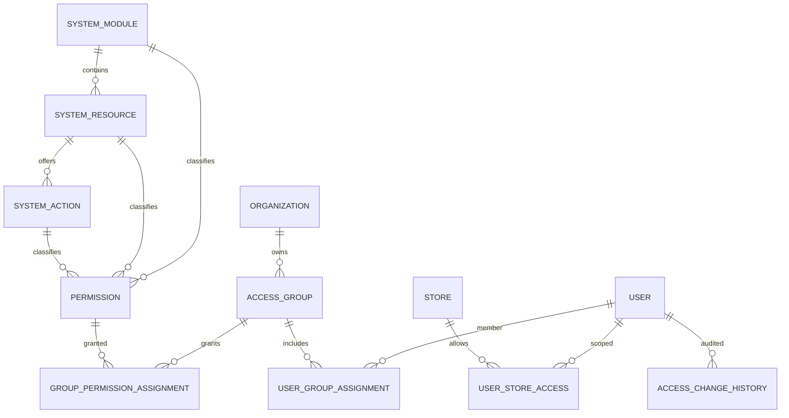
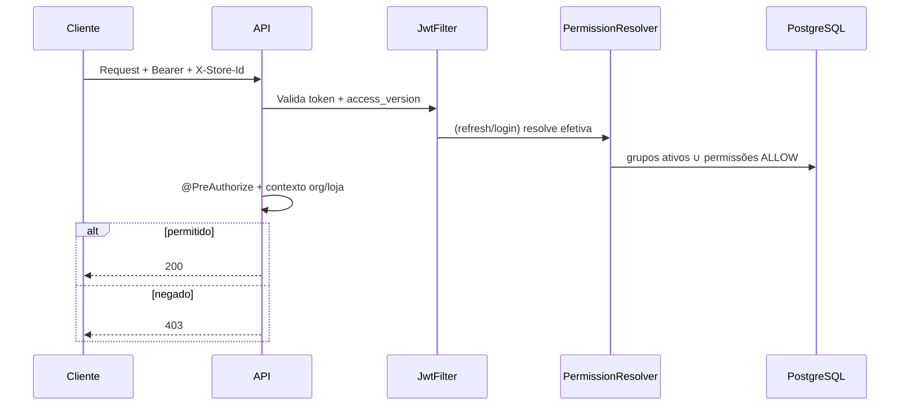

# Arquitetura de controle de acesso — SystemCommerce

> Prompts 151–155. Complementa [RBAC_MODEL.md](./RBAC_MODEL.md), [PERMISSION_CATALOG.md](./PERMISSION_CATALOG.md), [ACCESS_SECURITY.md](./ACCESS_SECURITY.md), [ACCESS_SCOPES.md](./ACCESS_SCOPES.md) (156–161).

---

## 1. Decisão estrutural (obrigatória)

| Conceito de produto | Nome técnico (DB/JPA) | Motivo |
|---------------------|----------------------|--------|
| **Grupo de usuários** | Tabela `roles` / entidade `Role` (API: Access Group) | Evitar dualidade Role × AccessGroup e blast radius em ~50 migrations + JWT/front |
| Permissão | `permissions` | Mantida; enriquecida com módulo/recurso/ação |
| Atribuição usuário↔grupo | `user_group_assignments` (+ legado `user_roles` sincronizado) | Vigência, loja, motivo |
| Atribuição grupo↔permissão | `group_permission_assignments` (+ legado `role_permissions` sincronizado) | Escopo, auditoria |
| Acesso à loja | `user_store_access` (existente) | Escopo operacional multiloja |

**Não** existem duas estruturas concorrentes com a mesma finalidade: *Role* é o AccessGroup.

---

## 2. Hierarquia conceitual

```
SystemModule → SystemResource → SystemAction → Permission → AccessGroup (Role) → User
```

Exemplo: Módulo Vendas → Recurso Pedido → Ação Cancelar → `SALES_ORDER_CANCEL` → Grupo Supervisores → João.

---

## 3. Diagrama de entidades



---

## 4. Fluxo de autorização (API)



Frontend apenas oculta UI (`CanAccess`). **Esconder botão ≠ autorizar.**

---

## 5. Fluxos administrativos

### Criação de grupo
Admin → cria AccessGroup (org) → define tipo/escopo → salva → audita.

### Atribuição de permissões
Admin → seleciona ações do catálogo → GroupPermissionAssignment ALLOW → versionamento otimista → bump `access_version` dos membros → audita.

### Atribuição de usuário
Admin → UserGroupAssignment (opcional loja/vigência) → grupo principal informativo → bump `access_version` → audita.

### Cálculo de permissões efetivas
```
efetivas(user) =
  ∪ permissions(assignment)
  where assignment.active
    and group.active
    and (valid_from <= now)
    and (valid_to is null or valid_to >= now)
    and permission.active
    and grant_type = ALLOW
```

---

## 6. Matriz de escopos

| Escopo | Significado |
|--------|-------------|
| GLOBAL / SYSTEM | Superadmin; `GLOBAL_STORE_ACCESS` |
| ORGANIZATION | Grupo/permissão da organização |
| STORE | Vínculo ou grant limitado à loja |
| MODULE | Classificação do catálogo (não é escopo de runtime sozinho) |

Autorização crítica: permissão **e** contexto org/loja (`UserStoreAccess` / `X-Store-Id`).

---

## 7. Papéis lógicos

| Papel | Descrição |
|-------|-----------|
| Superadministrador | Concede qualquer permissão do catálogo; sistema |
| Administrador da organização | Administra grupos/usuários da própria org; não concede o que não possui |
| Administrador de loja | Escopo loja + grants de loja |
| Usuário operacional | Grupos operacionais (PDV, estoque, vendas…) |

---

## 8. Invalidação de sessão

- Coluna `users.access_version` (long) incrementada em mudanças de grupo/permissão.
- Claim JWT `av` deve coincidir; mismatch → 401 e forçar re-login/refresh.
- Refresh token re-resolve permissões do banco (fonte da verdade — **não** confiar só no token).

---

## 9. Migração

1. Catalogar módulos/recursos/ações (V280+).
2. Enriquecer `roles` / `permissions`.
3. Criar tabelas de assignment; copiar dados de `user_roles` / `role_permissions`.
4. Resolver efetivas via assignments.
5. API `/access-groups` + UI “Grupos”; manter `/roles` como alias de leitura.
6. Remover dualidade documental; legado join mantido sincronizado na 1ª fase.
