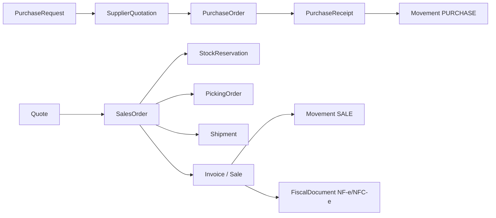

# Rastreabilidade de documentos — SystemCommerce

> **Série:** Evolução ERP profissional (Prompts 56–90)  
> Objetivo: origem tipada entre documentos, sem depender só de texto livre.

## 1. Regra geral

Todo documento gerado a partir de outro **deve** preservar:

| Campo | Descrição |
|---|---|
| `origin_document_type` | Enum tipado (`QUOTE`, `SALES_ORDER`, `PURCHASE_ORDER`, …) |
| `origin_document_id` | UUID do documento de origem |
| `origin_document_number` | Número legível no momento da conversão |
| `converted_at` | Instant da conversão |
| `converted_by` | Usuário responsável |
| Itens | Ligação item→item com `quantity_converted` e `quantity_remaining` |

Históricos **não** são apagados; cancelamento é status + movimento compensatório.

## 2. Ligações atuais (as-is)

| Origem → Destino | Mecanismo |
|---|---|
| Quote → SalesOrder | `quotes.converted_sales_order_id` + `sales_orders.quote_id` |
| SalesOrder → Sale | `sales_orders.generated_sale_id` (Sale ainda sem `sales_order_id`) |
| PurchaseOrder → PurchaseReceipt | `purchase_receipts.purchase_order_id` |
| PurchaseReceipt → Movement | `reference_type=PURCHASE_RECEIPT`, `reference_id` |
| Sale → Movement | `reference_type`/`reference_id` SALE |

## 3. Modelo alvo

### 3.1 Enum `OriginDocumentType`

```
PURCHASE_REQUEST, SUPPLIER_QUOTATION, PURCHASE_ORDER, PURCHASE_RECEIPT, SUPPLIER_RETURN,
QUOTE, SALES_ORDER, STOCK_RESERVATION, PICKING_ORDER, SHIPMENT, SALE, INVOICE_PROCESS,
FISCAL_DOCUMENT, FISCAL_EVENT, FISCAL_INUTILIZATION
```

Extensão fiscal: [FISCAL_TRACEABILITY.md](./FISCAL_TRACEABILITY.md).

### 3.2 Tabela `document_conversions` (fundação)

Registro imutável de cada conversão documento→documento (cabeçalho).

```
id, organization_id, store_id,
from_type, from_id, from_number,
to_type, to_id, to_number,
converted_at, converted_by_user_id,
notes
```

### 3.3 Tabela `document_conversion_items`

```
id, conversion_id,
from_item_id, to_item_id,
quantity_source, quantity_converted, quantity_remaining
```

### 3.4 FK diretas (continuam)

FKs específicas (`quote_id`, `purchase_order_id`, …) permanecem para joins rápidos.  
`document_conversions` é o **histórico canônico** e cobre conversões parciais/múltiplas.

## 4. Diagrama de fluxo de rastreio



## 5. Snapshot comercial

Pedidos e vendas devem preservar **nome e documento** do cliente/fornecedor usados no momento (colunas snapshot), para que alteração futura do cadastro **não** reescreva histórico.

Estado atual: parcial (nome via join). Evolução: `customer_name_snapshot`, `customer_document_snapshot` em SO/Sale; análogo em PO.

## 6. Estratégia de migração

| Passo | Ação |
|---|---|
| V183+ | Criar `document_conversions` + items |
| Backfill | Quote↔SO, SO↔Sale, PO↔Receipt |
| Sale | Adicionar `sales_order_id` nullable |
| Serviços | Toda conversão grava conversion + atualiza saldo de qty convertida nos itens |
| Front | Exibir “origem” e “documentos gerados” só com dados da API |

## 7. Auditoria

Além de `document_conversions`, `DomainAuditService` / `audit_logs` registram organização, loja, usuário, ação e payload.  
Movimentos de estoque carregam origem e documento.

## 8. Critérios de aceite (Prompt 56)

- [x] Relacionamentos principais tipados (modelo definido)
- [x] Cadeias compra e venda mapeadas
- [x] Migração identificada sem entidades duplicadas
- [ ] Tabela `document_conversions` criada e serviços gravando (implementação)
