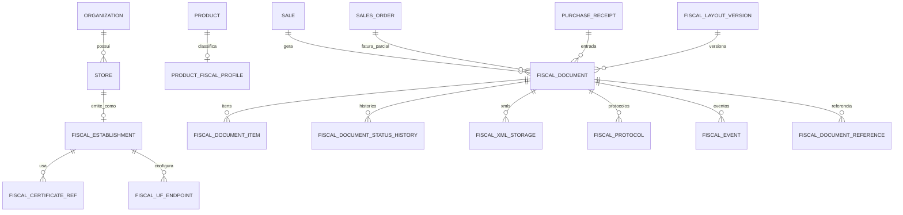

# Arquitetura do módulo fiscal — SystemCommerce (Prompt 121)

> **Série:** Módulo fiscal (Prompts 121+)  
> **Escopo:** arquitetura completa de NF-e (55), NFC-e (65) e base comum, integrada ao comercial, PDV, estoque e financeiro **sem duplicar** vendas, pagamentos ou movimentações.

Documentos complementares:

| Documento | Conteúdo |
|---|---|
| [NFE_ARCHITECTURE.md](./NFE_ARCHITECTURE.md) | NF-e modelo 55 |
| [NFCE_ARCHITECTURE.md](./NFCE_ARCHITECTURE.md) | NFC-e modelo 65 |
| [FISCAL_INTEGRATION.md](./FISCAL_INTEGRATION.md) | Integração com domínios existentes |
| [FISCAL_SECURITY.md](./FISCAL_SECURITY.md) | Certificados, assinatura, segredos |
| [FISCAL_CONTINGENCY.md](./FISCAL_CONTINGENCY.md) | Contingência e offline controlado |
| [FISCAL_VERSIONING.md](./FISCAL_VERSIONING.md) | Leiautes, schemas, NT, Reforma Tributária |
| [FISCAL_TRACEABILITY.md](./FISCAL_TRACEABILITY.md) | Status, XML, protocolos, auditoria |

Visão geral do monorepo: [`../ARCHITECTURE.md`](../ARCHITECTURE.md).

---

## 1. Princípio fundamental

```
Comercial / PDV  →  documento comercial confirmado (Sale, SalesOrder, PurchaseReceipt…)
Fiscal           →  documento fiscal eletrônico (XML + autorização SEFAZ)
Estoque          →  quantidades (já movimentadas pelo comercial)
Financeiro       →  valores (já gerados a partir do comercial)
```

O módulo fiscal **não**:

- recria `Sale`, `Payment`, `InventoryMovement` ou títulos AP/AR;
- baixa estoque ou gera financeiro por conta própria;
- expõe certificado, senha ou fórmula tributária oficial ao frontend;
- embute leiautes/URLs/regras de UF rigidamente no código-fonte.

O módulo fiscal **sim**:

- lê documentos comerciais já confirmados no contexto `organization_id` + `store_id`;
- monta, assina, valida, transmite e armazena DFe;
- registra eventos (cancelamento, CCe, manifestação, inutilização);
- imprime DANFE / DANFE NFC-e a partir do XML autorizado;
- opera por **adapters SEFAZ por UF** (Ceará como primeira implementação, não exclusividade).

---

## 2. Glossário (separação de conceitos)

| Conceito | Definição no SystemCommerce | Não confundir com |
|---|---|---|
| **Documento comercial** | Orçamento, pedido, venda (`Sale`), recebimento de compra, etc. | Documento fiscal (XML) |
| **Faturamento comercial** | `SalesOrderService.invoice` / histórico `SalesOrderBillingHistory` → cria/confirma `Sale` + estoque + (opcional) AR | Autorização SEFAZ |
| **Documento fiscal** | Registro interno `FiscalDocument` + modelo (55/65) + chave + status | Recibo PDV “DOCUMENTO NÃO FISCAL” |
| **Autorização fiscal** | Protocolo SEFAZ + XML autorizado persistido | Status `Sale.CONFIRMED` |
| **Movimentação de estoque** | `stock_movements` / `InventoryMovement` | Linhas da NF |
| **Geração financeira** | Payable / Receivable / liquidações | Totais de impostos no XML |
| **Evento fiscal** | Cancelamento, CCe, manifestação, inutilização, etc. | Cancelamento comercial da `Sale` |
| **Protocolo** | Número/recibo retornado pela SEFAZ | Idempotency-Key HTTP |
| **XML autorizado** | Payload oficial armazenado (enviado + autorizado/rejeitado) | Snapshot JSON da venda |
| **DANFE / DANFE NFC-e** | Representação gráfica impressa a partir do XML | Recibo de caixa |
| **Contingência** | Emissão com tipo de emissão ≠ normal, conforme legislação e config | Retry HTTP genérico |
| **Estabelecimento fiscal** | Perfil emissor por loja (CNPJ, IE, UF, CSC, ambiente) | `Store` cadastro comercial (é extensão, não cópia) |

---

## 3. Escopo da primeira entrega vs expansão

### 3.1 Primeira entrega (base)

- NF-e **modelo 55** (operações com mercadorias)
- NFC-e **modelo 65** (consumidor final / PDV)
- Ambientes **homologação** e **produção**
- Emissão normal, consulta recibo/situação, cancelamento, inutilização
- CCe quando aplicável (NF-e)
- Contingência (estratégia documentada; ativação por UF/config)
- Assinatura digital no backend (ou agente fiscal seguro)
- QR Code (NFC-e / requisitos legais)
- DANFE e DANFE NFC-e
- Armazenamento de XML enviado/recebido + protocolos
- Distribuição / manifestação do destinatário (estrutura)
- Entrada fiscal de compras (vinculação a `PurchaseReceipt`)
- Devolução, complementar, ajuste (quando legalmente aplicável) — modelo de referência entre documentos
- Faturamento parcial comercial → emissão proporcional / referenciada
- Monitor fiscal, auditoria, relatórios fiscais básicos
- Versionamento de schemas e preparação NT Reforma Tributária (ex.: NT 2025.002+)

### 3.2 Expansão futura (não misturar na 1ª entrega)

- NFS-e, CT-e, MDF-e e demais DFe
- Integrações legadas de cupom estadual (arquitetura de adapter pronta; implementação sob demanda)
- Cálculo completo IBS/CBS pós-reforma (campos e versionamento já previstos)

---

## 4. Pacotes internos (`br.com.systemcommerce.fiscal`)

Espelha o padrão de `finance.*` (domínio top-level).

```
fiscal/
├── configuration/     # ambientes, UF, prazos, feature flags, CSC refs
├── establishment/     # estabelecimento fiscal por loja (CNPJ, IE, UF)
├── certificate/       # ciclo de vida do A1/A3 (agente), criptografia de segredos
├── taxation/          # NCM, CEST, CFOP, CST/CSOSN, regras, Reforma (versão)
├── document/          # FiscalDocument comum (55/65), itens, status, refs
├── nfe/               # especificidades modelo 55
├── nfce/              # especificidades modelo 65
├── event/             # cancelamento, CCe, inutilização, manifestação…
├── transmission/      # orquestração envio/consulta + adapters SEFAZ
├── contingency/       # modos de contingência por UF
├── print/             # DANFE / DANFE NFC-e / QR
├── distribution/      # distribuição DFe / consulta destinatário
├── validation/        # XSD oficiais + regras de negócio pré-SEFAZ
├── storage/           # blob XML, protocolos, retenção
├── monitoring/        # fila, rejeições, health SEFAZ, alertas
├── report/            # relatórios fiscais
├── integration/       # ganchos Sale / PDV / Purchase / Finance (só leitura + link)
├── security/          # auditoria fiscal, sanitização, permissões
└── approval/          # (opcional) 2 etapas para cancelamento/inutilização — padrão finance.approval
```

### Dependências permitidas

```
fiscal → organization, store (pos.store), customer, supplier, carrier,
         product (cadastro + fiscal profile), sale, salesorder, purchase,
         shared.audit, storecontext

fiscal ↛ inventory (escrita), finance (escrita de títulos)
fiscal → finance (somente leitura de vínculo / totais já gerados, se necessário)

sale / pos / purchase → fiscal.integration (disparo opcional configurável)
```

**Regra:** estoque e financeiro continuam sendo consequências do **documento comercial**. O fiscal apenas **referencia** esses documentos.

---

## 5. Modelo de entidades (alvo)



### Entidades principais

| Entidade | Papel |
|---|---|
| `FiscalEstablishment` | Emissor por loja: CNPJ, IE, IM, UF, CRT, CSC (ref), ambiente default |
| `FiscalCertificateRef` | Metadados do certificado; segredo em cofre/criptografia (nunca plain) |
| `ProductFiscalProfile` | NCM, CEST, origem, CSTs, alíquotas versionadas, flags Reforma |
| `FiscalDocument` | Cabeçalho DFe interno (modelo, série, número, chave, status, layoutVersion) |
| `FiscalDocumentItem` | Itens com snapshot tributário (BigDecimal) no momento da emissão |
| `FiscalDocumentStatusHistory` | Histórico imutável de status |
| `FiscalXmlStorage` | XML enviado / retornado / autorizado (ou rejeitado) |
| `FiscalProtocol` | Recibo, protocolo autorização, nProt eventos |
| `FiscalEvent` | Eventos vinculados (cancelamento, CCe, …) |
| `FiscalDocumentReference` | refNFe / documentos relacionados (devolução, complementar) |
| `FiscalLayoutVersion` | Versão de leiaute + schema + NT aplicável |
| `FiscalUfServiceConfig` | URLs/serviços por UF + ambiente (homolog/prod) |
| `FiscalNumberingSeries` | Série/número por estabelecimento + modelo (controle concorrente) |
| `FiscalInutilization` | Faixas inutilizadas |
| `FiscalContingencySession` | Sessão de contingência ativa por estabelecimento |

**Imutabilidade:** documento com status **autorizado** (ou equivalente legal) **não pode ser apagado**. Correções = eventos ou novos documentos.

---

## 6. Máquina de status (documento fiscal)

```
DRAFT → VALIDATED → SIGNED → TRANSMITTED → PROCESSING
                         ↓
              AUTHORIZED | REJECTED | DENIED
                         ↓
         (eventos) CANCELLED | CORRECTED (CCe) | …

CONTINGENCY_* paralelos conforme tipo de emissão
```

Transições registradas em `FiscalDocumentStatusHistory` + auditoria (`DomainAuditService` / `FiscalAuditService`).

---

## 7. Adapters SEFAZ (por UF)

```
transmission/
  SefazTransmissionPort          # interface de domínio
  adapter/
    SefazAdapterRegistry         # UF + modelo + ambiente → adapter
    AbstractSefazSoapAdapter     # comum (TLS, timeout, idempotência)
    CearaNfeAdapter              # primeira implementação
    CearaNfceAdapter
    GenericSvrsAdapter           # SVRS / outros (expansão)
    StubSefazAdapter             # testes / CI
```

Contrato do port (conceitual):

- `authorize(SignedXml)`
- `queryReceipt(nRec)`
- `queryStatus(chave)`
- `sendEvent(eventXml)`
- `inutilize(xml)`
- `distribute(…)` / `queryRecipient(…)`

Endpoints, namespaces e versões de serviço vêm de `FiscalUfServiceConfig` + `FiscalLayoutVersion`, **não** de constantes espalhadas.

---

## 8. Tributação (`taxation`)

- Regras **somente no backend**.
- Frontend: captura de cadastros (NCM, CFOP sugerido, flags) e exibição de totais **já calculados** pela API.
- Cálculos com `BigDecimal` (escala e arredondamento definidos por regra versionada).
- Perfis de produto **globais** (`Product`) + overrides por organização/loja quando necessário.
- Preparação Reforma Tributária: campos versionados (IBS/CBS/IS, cClassTrib, etc.) ligados a `FiscalLayoutVersion` — ver [FISCAL_VERSIONING.md](./FISCAL_VERSIONING.md).

---

## 9. Multiloja e estabelecimento

- Contexto obrigatório: `X-Store-Id` / `CurrentStoreContext`.
- Emissão usa CNPJ/IE/UF do **estabelecimento fiscal da loja** (não “mistura” CNPJ da organização se a loja tiver emitente próprio).
- Numeração (série/número) **por estabelecimento + modelo + ambiente**.
- Permissões granulares (`FISCAL_*`) filtradas por org/loja como nos demais módulos.

---

## 10. Frontend (`SystemCommerce-front`)

| Permitido | Proibido |
|---|---|
| Telas de monitor, consulta, DANFE (PDF/stream da API) | Fórmulas de ICMS/PIS/COFINS/IBS |
| Cadastro de estabelecimento, CSC (via API), perfil fiscal produto | Assinatura XML no browser |
| Disparo “emitir NF” / “cancelar” (chama API) | Upload de certificado com senha em localStorage |
| Exibir status/chave/protocolo | Decisão de CFOP “oficial” sem validação backend |

Pasta sugerida: `src/fiscal/` + `fiscalApi.ts` + rotas `/fiscal/...`.

---

## 11. Flyway e permissões

- Migrations a partir de **V252+** (V251 = último financeiro).
- Seeds de permissões no mesmo padrão de `V251` / finance.
- Exemplos de códigos: `FISCAL_DOCUMENT_READ`, `FISCAL_DOCUMENT_EMIT`, `FISCAL_DOCUMENT_CANCEL`, `FISCAL_CERTIFICATE_MANAGE`, `FISCAL_MONITOR_ACCESS`, `FISCAL_REPORT_READ`, `FISCAL_INUTILIZE`, `FISCAL_CONTINGENCY_MANAGE`.

---

## 12. Critérios de aceite (Prompt 121)

| Critério | Como atende |
|---|---|
| Arquitetura documentada | Este arquivo + complementares |
| Separação comercial × fiscal | Glossário §2 + integrações |
| NF-e e NFC-e com base comum | `document` + `transmission` + `taxation` |
| Integrações por adapters | §7 |
| Sem dependência fiscal no frontend | §10 |
| Sem duplicação estoque/financeiro | §1 + [FISCAL_INTEGRATION.md](./FISCAL_INTEGRATION.md) |
| Estratégia normativa | [FISCAL_VERSIONING.md](./FISCAL_VERSIONING.md) |

---

## 13. Sequência sugerida de prompts seguintes

1. Cadastros: establishment, certificate, product fiscal profile, UF config  
2. Documento comum + numeração + storage XML  
3. NF-e emissão/consulta/cancelamento/CCe  
4. NFC-e + QR + CSC + PDV  
5. Contingência + monitor  
6. Entrada fiscal compras + referências (devolução/complementar)  
7. Relatórios + distribuição/manifestação  
8. Hardening Reforma Tributária / NT posteriores  
