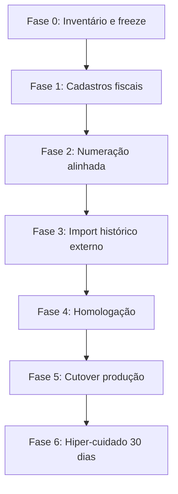

# Plano de migração fiscal — SystemCommerce

> Prompt 150. Complementa [FISCAL_INTEGRATION.md](./FISCAL_INTEGRATION.md) e [FISCAL_ARCHITECTURE.md](./FISCAL_ARCHITECTURE.md).

---

## 1. Princípio absoluto

**Não criar automaticamente documentos fiscais retroativos** sem procedimento formal (ata/plano aprovado por contabilidade + TI + operação).

Documentos já emitidos em outro sistema entram apenas como **histórico externo importado** (`EXTERNAL_HISTORY`), preservando chave, número, série, XML, protocolo, data, status, loja e vínculo comercial — **sem** gerar nova numeração, estoque ou financeiro.

---

## 2. Inventário pré-migração (checklist)

| Domínio | Verificar | Ação típica |
|---------|-----------|-------------|
| Vendas existentes | `sales` / pedidos faturados sem NF | Mapear para emissão futura ou histórico externo |
| Faturamentos | `SalesOrderBillingHistory` | Não regenerar NF; vincular se XML existir |
| Pagamentos | meios e liquidações | Conferir totais × NF futura |
| Clientes | CPF/CNPJ, IE, UF, e-mail | Completar perfil fiscal |
| Fornecedores | CNPJ, IE | Perfil fiscal + entrada |
| Produtos | NCM, origem, CEST, perfil fiscal | Bloquear emissão se incompleto |
| Lojas | CNPJ/estabelecimento 1:1 | Criar `fiscal_establishments` |
| Config tributária | CRT, CFOP, CST/CSOSN | Importar para catálogos versionados |
| Séries já usadas | última NF por série/modelo | Ajustar `fiscal_number_sequences` **acima** do último usado |
| DFe externos | XML/DANFE de sistemas legados | Importar via `/api/v1/fiscal/migration/external-history` |

---

## 3. Fases recomendadas

### Fase 0 — Inventário
- Exportar séries/números máximos por modelo/UF.
- Listar XMLs autorizados fora do SystemCommerce.
- Congelar mudanças de CRT/série sem ticket.

### Fase 1 — Cadastros
- Estabelecimentos, certificados A1 (homolog), perfis produto/cliente, operações.

### Fase 2 — Numeração
- Configurar sequência = `max(legado) + 1`.
- Inutilizar faixas se necessário (procedimento formal).

### Fase 3 — Histórico externo
- Importar XML + protocolo por lote (`migrationBatchId`).
- **Proibido:** emitir NF-e/NFC-e “para fechar lacunas” sem orientação fiscal.

### Fase 4–6
- Seguir [FISCAL_HOMOLOGATION_PLAN.md](./FISCAL_HOMOLOGATION_PLAN.md) e [FISCAL_PRODUCTION_READINESS.md](./FISCAL_PRODUCTION_READINESS.md).

---

## 4. Importação de histórico externo

Endpoint: `POST /api/v1/fiscal/migration/external-history`  
Permissão: `FISCAL_HISTORY_IMPORT`

Preserva: chave, número, série, XML, protocolo, data, status, loja, `originDocumentType/Id`.

Regras:
- Não movimenta estoque.
- Não gera título financeiro.
- Não consome numeração interna (usa número informado).
- Impede duplicidade por chave de acesso e por (estabelecimento, modelo, série, número, ambiente).
- Documento fica imutável (`AUTHORIZED` ou status informado) com `purpose = EXTERNAL_HISTORY`.

---

## 5. Critérios de saída da migração

- [ ] Todas as lojas com estabelecimento e certificado de homologação
- [ ] Sequências alinhadas ao legado
- [ ] Histórico externo importado ou formalmente descartado
- [ ] Nenhum documento retroativo emitido “só para preencher”
- [ ] Assinatura do contador no plano de cutover
