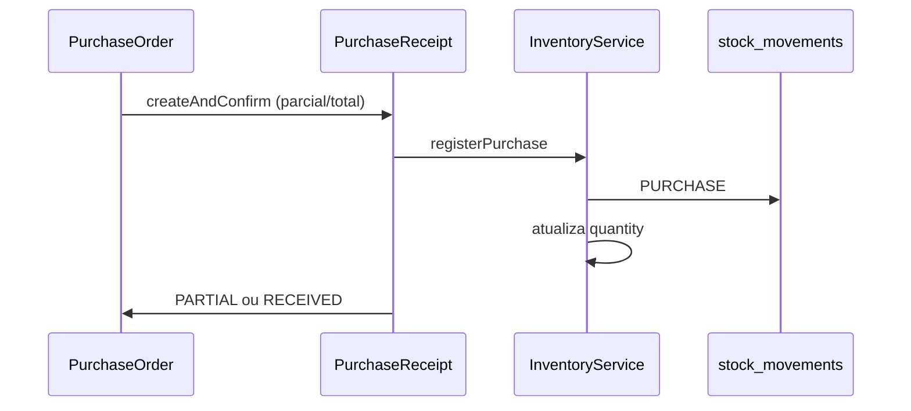
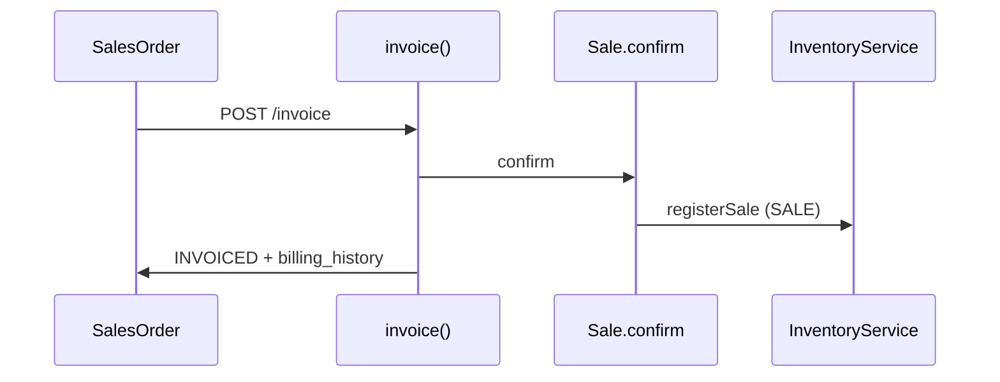

# Arquitetura de Estoque — SystemCommerce

> **Série:** Evolução ERP profissional (Prompts 56–90)  
> Complementa `docs/INVENTORY_MULTISTORE.md` (consolidado em `DOCUMENTATION.md`).

## 1. Princípios

1. Saldo **nunca** é alterado diretamente (proibido `UPDATE inventory SET quantity`).
2. Toda entrada/saída gera `InventoryMovement` (`stock_movements`).
3. Estoque pertence a **(produto, depósito)**; loja deriva do depósito.
4. Produto é **global** na organização; disponibilidade comercial por loja via `StoreProduct`.
5. Operações críticas: `@Transactional`, idempotência quando houver retry, auditoria.

## 2. Saldos oficiais

Colunas em `inventory`:

| Campo | Significado |
|---|---|
| `quantity` | Físico |
| `quantity_reserved` | Reservado (pedidos/orçamentos com reserva real) |
| `quantity_blocked` | Bloqueado (inventário/qualidade) |
| `quantity_in_transit` | Em transferência |

Fórmulas: `InventoryBalanceFormulas` (disponível = físico − reservado − bloqueado, etc.).

## 3. Tipos de movimentação (Prompt 62)

| Tipo | Origem típica |
|---|---|
| `PURCHASE` | `PurchaseReceipt` |
| `PURCHASE_CANCEL` | Estorno recebimento (futuro) |
| `SALE` | `Sale.confirm` |
| `SALE_CANCEL` | Cancelamento venda |
| `TRANSFER_OUT` / `TRANSFER_IN` / `TRANSFER_IN_TRANSIT` | Transferência entre depósitos |
| `ADJUSTMENT_POSITIVE` / `ADJUSTMENT_NEGATIVE` / `CORRECTION` | Ajuste autorizado |
| `CUSTOMER_RETURN` | Devolução cliente |
| `SUPPLIER_RETURN` | Devolução fornecedor |
| `INVENTORY` | Inventário |
| `INTERNAL_CONSUMPTION` | Consumo interno |
| `PRODUCTION` | Produção (futuro) |
| `ENTRY` / `EXIT` / `FUTURE_RETURN` | Legado / entradas manuais |

Cada movimento registra: produto, loja, depósito, tipo, quantidade, saldo anterior/posterior, origem (`reference_type`), documento (`reference_id`), usuário, data.

## 4. Fluxos transacionais





## 5. Reserva formal de estoque (Prompt 70 — `StockReservation`)

Implementado em `reservation.*` (`stock_reservations`, `stock_reservation_items`,
`stock_reservation_status_history` — migrations V203/V207). **Nunca** altera o saldo físico
(`inventory.quantity`); apenas `quantity_reserved`, sempre via `InventoryService` sob **lock
pessimista** na linha `(product_id, warehouse_id)` de `inventory`:

| Método `InventoryService` | Efeito | Validação |
|---|---|---|
| `reserveQuantity(productId, warehouseId, qty)` | `quantity_reserved += qty` | Exige `disponível ≥ qty` (`InventoryBalanceFormulas.available`) |
| `consumeReservedQuantity(...)` | `quantity_reserved -= qty` (consumo definitivo, ex.: faturamento) | Exige reservado suficiente |
| `releaseReservedQuantity(...)` | `quantity_reserved -= qty` (libera sem consumir, ex.: cancelamento/divergência) | Exige reservado suficiente |

Conflitos de concorrência (`ObjectOptimisticLockingFailureException` no `@Version` de `Inventory`)
são convertidos em `BusinessRuleException` amigável — o cliente deve reapresentar a requisição.

### Ciclo de vida (`StockReservationService`)

```
ACTIVE ──consume parcial──> PARTIALLY_CONSUMED ──consome restante──> CONSUMED
  │                                │
  ├──release/cancel/expire──> RELEASED | CANCELLED | EXPIRED
```

- `create`: origem `QUOTE` ou `SALES_ORDER` (`originType` + `originId`); **idempotente** por
  `(organization_id, idempotency_key)` — reenvio retorna a reserva existente sem duplicar.
- `consume(id, lines)` / `consumeForOrigin(originType, originId, lines)`: uso típico no
  faturamento ou na conclusão de separação (`PickingOrder.complete`); best-effort quando por
  origem (não falha se não houver reserva aberta).
- `release` / `releaseForOrigin`: libera parcial (divergência) ou total (cancelamento).
- `expireActivePastDue` (`@Scheduled`, padrão a cada 15 min, configurável via
  `systemcommerce.reservation.expire-cron`): libera automaticamente reservas `ACTIVE` /
  `PARTIALLY_CONSUMED` com `expires_at` vencido.

### Integração automática (opcional)

`SalesOrderService.approve()` cria uma `StockReservation` automaticamente quando o pedido tem
`reserve_stock = true` **e** depósito definido — idempotente por pedido (`SO-APPROVE-{id}`);
falta de estoque não impede a aprovação (best-effort, registrado apenas se a reserva puder ser
criada).

Endpoints: `/api/v1/stock-reservations` (`STOCK_RESERVATION_READ` / `STOCK_RESERVATION_MANAGE`).

## 6. Isolamento multiloja

- Consultas de saldo filtradas por depósitos das lojas autorizadas.
- Transferência exige origem e destino explícitos.
- Relatórios respeitam `allowedStoreIds`.

## 7. Critérios de aceite

- [x] Saldo só via movimentação
- [x] Tipos comerciais de compra/venda cobertos
- [x] Recebimento e faturamento documentados como únicos geradores de entrada/saída comercial
- [x] `StockReservation` operacional (Prompt 70) — nunca altera saldo físico, só `quantity_reserved`

## 8. Inventário físico (Prompt 74 — `inventorycount.*`)

Migrations **V208** (tabelas) + **V214** (permissões). Pacote `inventorycount.*`.

| Status | Significado |
|---|---|
| `PLANNED` → `OPEN` → `COUNTING` | Planejamento e 1ª contagem |
| `RECOUNTING` | 2ª contagem quando `require_second_count` e divergência entre passagens |
| `UNDER_ANALYSIS` → `APPROVED` → `POSTED` | Análise, aprovação obrigatória, postagem |
| `CANCELLED` | Encerramento sem ajuste |

Regras: `freeze_balances`, `hide_theoretical_qty`, variância calculada na API (`variance = final − teórico`), idempotência por `idempotency_key` (cabeçalho e entradas). **POSTED** gera `inventory_count_adjustments` + movimentos `INVENTORY` via `InventoryService.registerInventoryMovement` (motivo `INVENTORY_COUNT`).

Endpoints: `/api/v1/inventory-counts` — permissões `INVENTORY_COUNT_READ|CREATE|MANAGE|POST`.

## 9. Transferência — dispatch/divergência (Prompt 75)

Migration **V209** adiciona `stock_transfer_dispatches` e `stock_transfer_divergences`. O fluxo principal permanece em `stocktransfer.*`; `dispatch()` persiste `StockTransferDispatch` (idempotente); `registerDivergence()` persiste `StockTransferDivergence` tipada (`SHORTAGE`, `EXCESS`, etc.).

## 10. Lotes (Prompt 76 — `batch.*`)

Migration **V210**: `product_batches`, `batch_inventories`, `batch_movements`, `batch_reservations`; colunas `products.requires_batch`, `fefo_enabled`. FEFO configurável; lote `BLOCKED`/`EXPIRED` não vende (`validateBatchForSale`); recebimento exige lote se `requires_batch`.

Endpoints: `/api/v1/product-batches` — `BATCH_READ` / `BATCH_MANAGE`.

## 11. Números de série (Prompt 77 — `serial.*`)

Migration **V211**: série única por organização; status `AVAILABLE|RESERVED|SOLD|RETURNED|DEFECTIVE|IN_TRANSIT|BLOCKED`; histórico imutável.

Endpoints: `/api/v1/serial-numbers` — `SERIAL_READ` / `SERIAL_MANAGE`.

## 12. Kits/combos (Prompt 78 — `bundle.*`)

Migration **V212**: `product_bundles`, itens, políticas de preço e estoque. Circularidade proibida (DFS na API); preço e disponibilidade resolvidos no backend.

Endpoints: `/api/v1/product-bundles` — `BUNDLE_READ` / `BUNDLE_MANAGE`.

## 13. Produção / BOM (Prompt 79 — `production.*`)

Migration **V213**: BOM versionada, `production_orders` com consumo/saída/perda. Status `DRAFT` → … → `COMPLETED`; consumo OUT e acabado IN via `registerProductionConsumption` / `registerProductionOutput`; custo calculado no backend.

Endpoints: `/api/v1/bills-of-materials`, `/api/v1/production-orders` — `BOM_*`, `PRODUCTION_*`.
