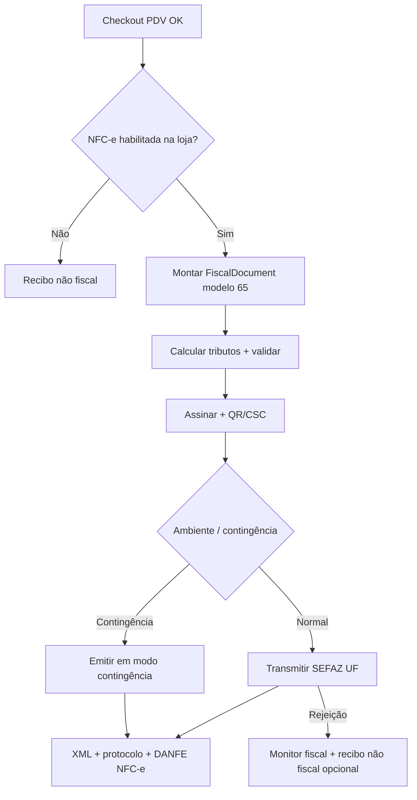

# Arquitetura NFC-e (modelo 65) — SystemCommerce

> Complementa [FISCAL_ARCHITECTURE.md](./FISCAL_ARCHITECTURE.md).  
> Pacote: `br.com.systemcommerce.fiscal.nfce` (reutiliza a mesma base que NF-e).

---

## 1. Papel

NFC-e (**modelo 65**) cobre venda ao **consumidor final**, tipicamente no **PDV**:

- emissão vinculada à `Sale` com `channel = POS` (mesma venda comercial; sem `PosSale`);
- QR Code conforme NT / MOC vigentes;
- CSC (token) por estabelecimento/UF — armazenado de forma segura;
- DANFE NFC-e (via consumidor / impressão térmica);
- contingência off-line / EPEC / SVC conforme configuração da UF;
- convivência temporária com recibo **“DOCUMENTO NÃO FISCAL”** até a política da loja exigir só NFC-e.

---

## 2. Integração PDV

```
PosCheckoutService.finalize
        → Sale confirmada (estoque + pagamentos)
        → PosFinanceIntegrationService (AR/liquidação — existente)
        → FiscalIntegrationService.emitNfceIfConfigured(saleId)   # novo, opcional
```

Regras:

- NFC-e **depois** (ou na mesma transação de aplicação, após commit comercial) da confirmação da venda — nunca antes da baixa de estoque comercial se a política exigir venda confirmada.
- Falha de SEFAZ **não** desfaz estoque/pagamento automaticamente; status comercial permanece e o monitor fiscal trata rejeição/contingência/reenvio.
- Idempotência: uma venda → no máximo um documento NFC-e “ativo” (não cancelado); reenvio usa a mesma chave de idempotência.

Espelha o padrão de [`PDV_FINANCIAL_INTEGRATION.md`](./PDV_FINANCIAL_INTEGRATION.md).

---

## 3. Diferenças em relação à NF-e (mesma base)

| Aspecto | NF-e 55 | NFC-e 65 |
|---|---|---|
| Pacote específico | `fiscal.nfe` | `fiscal.nfce` |
| Consumidor | Identificado / contribuinte | Consumidor final (CPF opcional conforme regras) |
| QR Code | Conforme regras | Obrigatório nos termos legais |
| CSC | N/A típico | Obrigatório (config estabelecimento) |
| CCe | Sim | Em geral não aplicável (cancelamento / novo doc) |
| Impressão | DANFE | DANFE NFC-e + QR |
| Origem principal | ERP / pedido | PDV |

Montagem XML, assinatura, storage, status e adapters **compartilhados**.

---

## 4. Fluxo resumido



---

## 5. CSC e segurança

- CSC id / token: cadastrados via API; token **criptografado em repouso** (mesmo padrão de certificado — [FISCAL_SECURITY.md](./FISCAL_SECURITY.md)).
- Nunca enviados ao frontend em claro após gravação (máscara + rotação).
- QR Code gerado no backend na montagem/autorização.

---

## 6. Impressão

- `fiscal.print` gera payload DANFE NFC-e (PDF ou ESC/POS conforme terminal).
- Terminal PDV consome endpoint de impressão; layout fiscal oficial não é recalculado no React.

---

## 7. Critérios de aceite (arquitetura NFC-e)

- [x] Modelo 65 na base `FiscalDocument`
- [x] Integração PDV sem duplicar Sale/estoque/financeiro
- [x] CSC/QR/DANFE NFC-e definidos
- [x] Contingência referenciada
- [x] Reuso de adapters/transmission com NF-e
