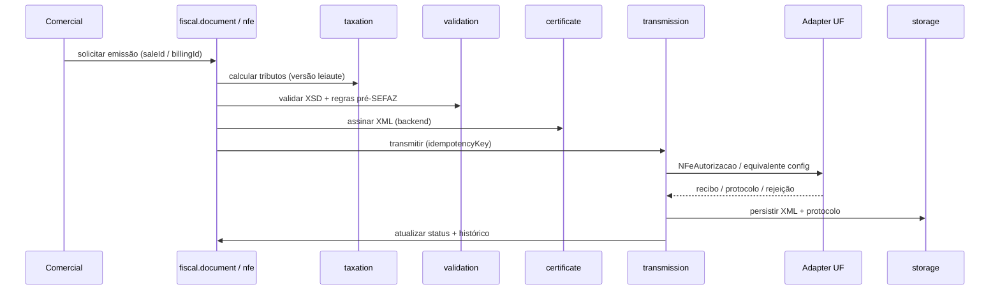

# Arquitetura NF-e (modelo 55) — SystemCommerce

> Complementa [FISCAL_ARCHITECTURE.md](./FISCAL_ARCHITECTURE.md).  
> Pacote: `br.com.systemcommerce.fiscal.nfe` (reutiliza `document`, `taxation`, `transmission`, `event`, `print`, `storage`).

---

## 1. Papel

NF-e (**modelo 55**) cobre operações com mercadorias entre estabelecimentos/contribuintes e fluxos ERP (pedido → faturamento → emissão), incluindo:

- venda B2B / transferência / devolução / complementar / ajuste (quando aplicável);
- referência a outros DFe (`refNFe` / `FiscalDocumentReference`);
- Carta de Correção Eletrônica (CCe);
- inutilização de numeração;
- contingência conforme UF e NT vigentes;
- DANFE (retrato/paisagem) a partir do XML autorizado.

**Não** substitui NFC-e (65) no PDV consumidor final.

---

## 2. Origens comerciais típicas

| Origem | Gatilho sugerido | Observação |
|---|---|---|
| `SalesOrder` + `Sale` (canal ADMIN) | Após faturamento comercial (`invoice`) | Config: emissão automática ou manual |
| Faturamento parcial | Uma NF por parcela faturada / agregação configurável | Mantém referência ao pedido |
| Devolução de cliente | Documento comercial de devolução + estoque já tratado | NF de devolução referenciando NF original |
| Complementar / ajuste | Processo fiscal explícito | Não altera estoque automaticamente |
| Transferência entre lojas | Documento de transferência já existente | Emitente = estabelecimento da loja origem |

Integração detalhada: [FISCAL_INTEGRATION.md](./FISCAL_INTEGRATION.md).

---

## 3. Fluxo de emissão (normal)

Passos obrigatórios:

1. Resolver **estabelecimento fiscal** da loja (`CurrentStoreContext`).
2. Bloquear numeração (`FiscalNumberingSeries`) com controle de concorrência (optimistic lock / `SELECT FOR UPDATE`).
3. Montar XML na **versão de leiaute** ativa para UF/modelo/ambiente.
4. Validar schema oficial + regras internas.
5. Assinar (certificado do estabelecimento).
6. Transmitir via adapter da UF.
7. Consultar recibo se assíncrono; persistir resultado.
8. Em autorização: gravar chave, protocolo, XML autorizado; liberar DANFE.

---

## 4. Serviços NF-e (orquestrados via config)

| Operação | Responsável | Persistência |
|---|---|---|
| Autorização | `transmission` + `nfe` | XML + protocolo + status AUTHORIZED |
| Retorno de recibo | `transmission` | Atualiza status |
| Consulta situação | `transmission` | Pode reconciliar status local |
| Cancelamento | `event` | Evento + status CANCELLED (prazo configurável por UF) |
| CCe | `event` | Evento CORRECTION; XML original intacto |
| Inutilização | `event` / `nfe` | `FiscalInutilization` |
| Distribuição / manif. destinatário | `distribution` | Eventos de ciência/confirmação/desconhecimento/não realizada |

Prazos e permissões de eventos: `fiscal.configuration` (atualizáveis sem redeploy de regra hardcoded).

---

## 5. DANFE

- Gerado em `fiscal.print` **somente** a partir do XML autorizado (ou contingência válida).
- Frontend solicita `GET /api/v1/fiscal/documents/{id}/danfe` (stream PDF/HTML); não remonta layout fiscal no cliente.
- Dados comerciais (logo da loja) são complementares; totais fiscais vêm do XML.

---

## 6. Regras específicas (resumo)

- Destinatário: preferencialmente `Customer` com documento válido; operações sem destinatário seguem regra legal/config.
- Transportadora: `Carrier` quando informado no pedido/expedição.
- CFOP e natureza da operação: calculados/validados no backend conforme operação × UF emitente × UF destino.
- Valores: `BigDecimal`; divergência material entre totais da `Sale` e da NF **bloqueia** emissão (tolerância configurável em centavos).
- Documento autorizado **imutável**; correção = CCe ou documento novo.

---

## 7. Ceará e demais UFs

- CE: credenciamento, URLs e CSC (quando aplicável ao serviço) via `FiscalUfServiceConfig` + secrets.
- Outras UFs: novo adapter ou adapter genérico (SVRS/SVAN/próprio) registrado no `SefazAdapterRegistry`.
- Código de negócio NF-e **não** importa classes `Ceara*` diretamente — só o registry.

---

## 8. Critérios de aceite (arquitetura NF-e)

- [x] Modelo 55 na base comum `FiscalDocument`
- [x] Fluxo autorização / consulta / cancelamento / CCe / inutilização definido
- [x] Adapter por UF
- [x] Sem acoplamento exclusivo ao Ceará
- [x] DANFE a partir do XML
- [x] Sem recriar venda/estoque/financeiro
