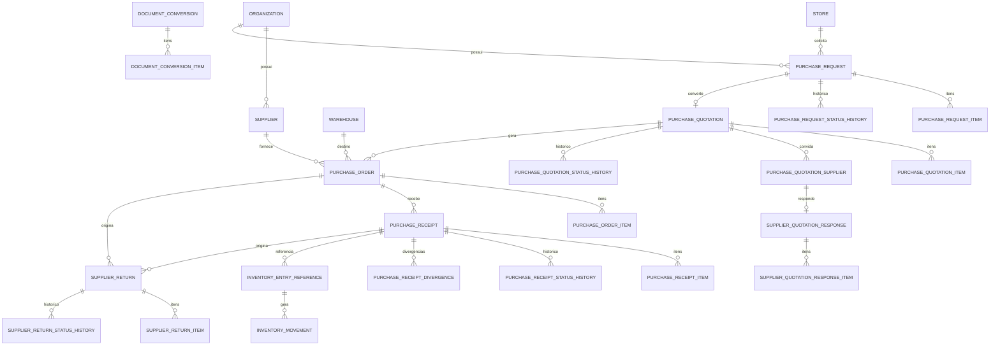

# Arquitetura de Compras — SystemCommerce

> **Série:** Evolução ERP profissional (Prompts 56–90)  
> **Escopo:** cadeia de documentos de compra, estoque como consequência, multiloja/multidepósito.  
> **Princípio:** não duplicar entidades já existentes; estender e vincular.
> **Status:** Prompts 56–63 **entregues** (backend Java completo). Frontend dos Prompts 59–63 pendente (outro time/agente).

## 1. Cadeia oficial

```
PurchaseRequest (Solicitação — Prompt 59)
        ↓ convert-to-quotation (DocumentConversion)
PurchaseQuotation (Cotação de compra — Prompt 60)   ← distinto de Quote (orçamento de venda)
        ↓ generate-purchase-orders (DocumentConversion, 1 PO por fornecedor selecionado)
PurchaseOrder (Pedido de compra — Prompt 61)        ← JÁ EXISTIA (V180); estendido (V193)
        ↓ post-to-inventory
PurchaseReceipt / GoodsReceipt (Prompt 62)          ← JÁ EXISTIA (V181); estendido fluxo (V194)
        ↓
Entrada no estoque (InventoryMovement PURCHASE, só quantityAccepted)
        ↓
AccountsPayable (Conta a pagar)           ← futuro
```

Devolução ao fornecedor (paralela — Prompt 63):

```
SupplierReturn (DRAFT → PENDING_APPROVAL → APPROVED → DISPATCHED → COMPLETED)
        ↓ complete()
InventoryMovement SUPPLIER_RETURN (InventoryService.registerSupplierReturn) → (crédito AP futuro)
```

## 2. Mapeamento conceito → implementação

| Conceito (Prompt 56) | Implementação | Status |
|---|---|---|
| PurchaseRequest / Item / StatusHistory | `purchase.entity.PurchaseRequest` (+ `PurchaseRequestItem`, `PurchaseRequestStatusHistory`), migration `V191` | **Entregue (Prompt 59)** |
| PurchaseQuotation / Item / Supplier / SupplierResponse | `purchase.entity.PurchaseQuotation` (+ `PurchaseQuotationItem`, `PurchaseQuotationSupplier`, `SupplierQuotationResponse`, `SupplierQuotationResponseItem`, `PurchaseQuotationStatusHistory`), migration `V192` | **Entregue (Prompt 60)** |
| PurchaseOrder / Item | `purchase.entity.PurchaseOrder` — campos profissionais (`V193`) | **Entregue (Prompt 61)** |
| GoodsReceipt / Item | `purchase.entity.PurchaseReceipt` (nome canônico) — fluxo granular (`V194`) | **Entregue (Prompt 62)** |
| SupplierReturn / Item / StatusHistory | `purchase.entity.SupplierReturn` (+ `SupplierReturnItem`, `SupplierReturnStatusHistory`), migration `V195` | **Entregue (Prompt 63)** |
| DocumentConversion (rastreabilidade) | `shared.document.DocumentConversion` + `DocumentConversionService.record(...)` | **Entregue (mínimo)** |
| Conta a pagar | Módulo financeiro futuro | Futuro |

**Regra de nomenclatura:** no código Java e nas tabelas usamos `PurchaseReceipt`. Em documentação de negócio, “Goods Receipt / Recebimento” é sinônimo. O alias REST `/api/v1/goods-receipts` delega ao mesmo `PurchaseReceiptService`.

## 3. Diagrama de entidades (compras)



## 4. Estados

### PurchaseRequest (Prompt 59 — entregue)
`DRAFT` → `SUBMITTED` → `UNDER_ANALYSIS` → `APPROVED` | `PARTIALLY_APPROVED` | `REJECTED` → `IN_QUOTATION` → `CONVERTED`; `CANCELLED` a partir de qualquer estado não terminal.
Saldo por item: `pending = (quantityApproved ?? quantityRequested) - quantityConverted`. `PurchaseRequest` **não movimenta estoque**.

### PurchaseQuotation (Prompt 60 — entregue)
`DRAFT` → `OPEN` (ao convidar fornecedores) → `SENT` → `RESPONSES_PENDING` → `UNDER_COMPARISON` → `PARTIALLY_SELECTED` | `SELECTED` → `CLOSED`; `CANCELLED` a partir de qualquer estado não travado (`CLOSED`/`CANCELLED` são finais e bloqueiam edição — respostas de fornecedor ficam `locked=true`).

### PurchaseOrder (Prompt 61 — entregue)
`DRAFT` → `PENDING_APPROVAL` (quando `approvalRequired` e total ≥ `approvalThresholdAmount`) → `APPROVED` → `SENT`/`SENT_TO_SUPPLIER` → `CONFIRMED_BY_SUPPLIER` → `PARTIAL`/`PARTIALLY_RECEIVED` → `RECEIVED`/`CLOSED`; `REJECTED` a partir de `PENDING_APPROVAL`; `CANCELLED` enquanto não recebido.
`PARTIAL` e `PARTIALLY_RECEIVED` são aliases — `applyReceiptProgress` grava o novo nome mantendo leitura compatível com integrações antigas.

### PurchaseReceipt / GoodsReceipt (Prompt 62 — entregue)
`DRAFT` → `UNDER_INSPECTION` → `PARTIALLY_ACCEPTED` | `ACCEPTED` → `POSTED_TO_INVENTORY`; `REJECTED`/`CANCELLED` como estados terminais alternativos. `CONFIRMED` é mantido apenas como status legado (equivalente a `POSTED_TO_INVENTORY`) para compatibilidade com registros antigos gerados por `createAndConfirm`.

### SupplierReturn (Prompt 63 — entregue)
`DRAFT` → `PENDING_APPROVAL` → `APPROVED` → `DISPATCHED` → `COMPLETED`; `REJECTED` a partir de `PENDING_APPROVAL`; `CANCELLED` permitido em `DRAFT`/`PENDING_APPROVAL`/`APPROVED`.

## 5. Numeração

| Documento | Prefixo | Escopo | Serviço |
|---|---|---|---|
| Solicitação de compra | `SC` | por loja | `StorePurchaseRequestSequenceService` (**entregue**) |
| Cotação de compra | `CC` | por loja | `StorePurchaseQuotationSequenceService` (**entregue**) |
| Pedido compra | `C` | por loja | `StorePurchaseOrderSequenceService` |
| Recebimento | UUID / sequencial interno | por org | atual |
| Devolução fornecedor | `DEV` | por loja | `StoreSupplierReturnSequenceService` (**entregue**) |

## 6. Estoque como consequência

- Criar/editar `PurchaseRequest` ou `PurchaseQuotation` **nunca** movimenta estoque — apenas geram documentos e, no máximo, `PurchaseOrder`s.
- Criar/editar `PurchaseOrder` **não** altera saldo.
- `PurchaseReceiptService.createDraft` → `inspect` → `accept` → `postToInventory` é o fluxo oficial (Prompt 62): somente `postToInventory` chama `InventoryService.registerPurchase` (`MovementType.PURCHASE`), e apenas para `quantityAccepted` (nunca a quantidade recebida bruta). O endpoint exige header `Idempotency-Key` para evitar postagem duplicada; cada posting cria um `InventoryEntryReference` rastreável.
- `PurchaseReceiptService.createAndConfirm` é mantido como atalho de compatibilidade (cria + posta em uma chamada), usado pelo fluxo legado do frontend.
- Quantidade **recusada/divergente** (`PurchaseReceiptDivergence`) não entra no estoque.
- `SupplierReturn.complete()` é o único ponto que baixa estoque de devolução, via `InventoryService.registerSupplierReturn` (`MovementType.SUPPLIER_RETURN`), validando saldo disponível antes de decrementar.
- Saldo nunca é UPDATE direto — sempre via movimentação oficial.

## 7. Multiloja

- Fornecedor = **global na organização**.
- Pedido e recebimento = **loja + depósito destino**.
- Queries validam acesso à loja (`StoreAuthorizationEvaluator`).
- Observações/condições por loja ficam em `supplier_store_conditions` (Prompt 57 — **entregue**, V184), não em cópia do fornecedor.

### 7.1 Cadastro profissional de fornecedores (Prompt 57 — entregue, V184/V185)

- `Supplier` ganhou `status` (`ACTIVE` \| `INACTIVE` \| `BLOCKED`), `municipal_registration`, `tax_contributor_indicator`, `category`, `blocked_at`, `blocked_reason`. CPF/CNPJ único por organização: `uk_suppliers_org_document (organization_id, document)`.
- `isUsableForPurchase()` = `status = ACTIVE` **e** `active = true`. `INACTIVE` e `BLOCKED` bloqueiam a criação de `PurchaseOrder` (`SupplierService`/`PurchaseOrderService`); regra só na API.
- Tabelas filhas: `supplier_addresses`, `supplier_contacts`, `supplier_bank_accounts` (permissões `SUPPLIER_BANK_DATA_READ`/`MANAGE`), `supplier_commercial_conditions` (padrão da organização — referência, não cálculo oficial), `supplier_store_conditions` (por loja), `supplier_products`, `supplier_status_history` (nunca apagado), `supplier_documents` (metadados, sem upload binário).
- Exclusão de fornecedor com estoque/pedido de compra/documento vinculado é sempre *soft delete* (nunca hard delete).
- Ver seção "Fornecedores" em `DOCUMENTATION.md` para a lista completa de endpoints e permissões.

## 8. Matriz de permissões (compras)

| Código | Uso |
|---|---|
| `PURCHASE_ORDER_READ/CREATE/UPDATE/CANCEL/APPROVE/SEND` | Pedido (Prompt 61 — **entregue**) |
| `PURCHASE_RECEIPT_READ/CREATE/INSPECT/ACCEPT/POST/REJECT/CANCEL` | Recebimento (Prompt 62 — **entregue**) |
| `PURCHASE_REQUEST_READ/CREATE/UPDATE/SUBMIT/ANALYZE/APPROVE/REJECT/CANCEL/CONVERT` | Solicitação de compra (Prompt 59 — **entregue**, seed `V196`) |
| `PURCHASE_QUOTATION_READ/CREATE/UPDATE/SEND/RESPOND/SELECT/GENERATE_ORDERS/CLOSE/CANCEL` | Cotação de compra (Prompt 60 — **entregue**, seed `V196`) |
| `SUPPLIER_RETURN_READ/CREATE/UPDATE/SUBMIT/APPROVE/REJECT/DISPATCH/COMPLETE/CANCEL` | Devolução ao fornecedor (Prompt 63 — **entregue**, seed `V196`) |
| `SUPPLIER_*`, `SUPPLIER_STATUS_MANAGE` | Cadastro / bloqueio / (in)ativação (Prompt 57 — **entregue**) |
| `SUPPLIER_BANK_DATA_READ/MANAGE` | Dados bancários do fornecedor (Prompt 57 — **entregue**) |

> Os nomes exatos de cada permissão seguem o seed de `V196__seed_purchase_chain_permissions.sql`; consulte a migration para a lista literal usada em `@PreAuthorize`.

## 9. Estratégia de migração

1. Documentar (este arquivo + `DOCUMENT_TRACEABILITY.md`) — **Prompt 56**.
2. Extender `Supplier` profissional — **Prompt 57 (entregue, V184/V185)**.
3. Introduzir `document_conversions` / origem tipada nos documentos existentes — **Prompt 56 (entregue, V183)**.
4. Criar `PurchaseRequest` (`V191`) e `PurchaseQuotation` (`V192`) com FK opcional em `purchase_orders` (`purchase_quotation_id`, `V193`) — **Prompts 59/60 (entregues)**.
5. Estender `PurchaseOrder` com campos profissionais (`V193`) e `PurchaseReceipt` com fluxo granular de inspeção/aceite/postagem (`V194`) — **Prompt 61/62 (entregues)**.
6. `SupplierReturn` documental completo (`V195`) com baixa de estoque oficial na conclusão — **Prompt 63 (entregue)**.
7. Contas a pagar — **futuro**.

## 10. Critérios de aceite

### Prompt 56 (fundação)
- [x] Arquitetura documentada sem duplicar `PurchaseOrder`/`PurchaseReceipt`
- [x] Estoque como consequência do recebimento
- [x] Multiloja definida
- [x] Migração identificada (sem tabela `goods_receipts` paralela)

### Prompts 59–63 (cadeia completa)
- [x] `PurchaseRequest` completo (CRUD, submit/analyze/approve/partially-approve/reject/cancel, convert-to-quotation) — não movimenta estoque
- [x] `PurchaseQuotation` completo (create manual/from request, invite/send, register-response, comparison, select-items, generate-purchase-orders, close/cancel) — respostas não vencedoras preservadas e travadas ao fechar/cancelar
- [x] `PurchaseOrder` estendido (V193): status profissionais, `destinationStore`, `purchaseQuotationId`, aprovação por valor, `revisionNumber`, `print-data`
- [x] `PurchaseReceipt`/GoodsReceipt com fluxo granular (draft → inspect → accept → post-to-inventory com `Idempotency-Key`), divergências e `InventoryEntryReference`; `createAndConfirm` mantido por compatibilidade
- [x] `SupplierReturn` completo com baixa de estoque oficial só no `complete()` via `InventoryService.registerSupplierReturn`
- [x] `DocumentConversion` mínimo integrado nas conversões request→quotation e quotation→PO
- [x] Testes unitários novos/atualizados passando (`PurchaseRequestServiceTest`, `PurchaseQuotationServiceTest`, `SupplierReturnServiceTest`, `PurchaseReceiptServiceTest`, `PurchaseOrderServiceTest`)
- [ ] Frontend das telas `/purchase-requests`, `/purchase-quotations`, fluxo de inspeção de recebimento e `/supplier-returns` (fora de escopo deste backend; outro agente)
