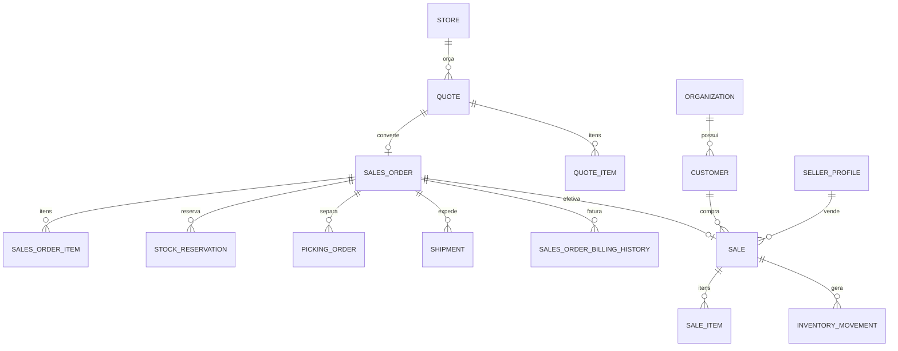

# Arquitetura de Vendas — SystemCommerce

> **Série:** Evolução ERP profissional (Prompts 56–90)  
> **Escopo:** cadeia comercial de vendas, reserva, separação, expedição, faturamento e estoque.

## 1. Cadeia oficial

```
SalesQuotation (Orçamento)          ← implementado como Quote / quotes (V175)
        ↓
SalesOrder (Pedido de venda)        ← V176
        ↓
StockReservation (Reserva)          ← Prompt 70 (V203) — quantity_reserved via InventoryService
        ↓
PickingOrder (Separação)            ← Prompt 71 (V204) — não baixa estoque físico
        ↓
Shipment (Expedição)                ← Prompt 72 (V205) — entrega não altera estoque
        ↓
InvoiceProcess / Faturamento        ← parcial: POST /invoice + sales_order_billing_history (V178)
        ↓
Sale + SaleItem (venda definitiva)  ← confirm() baixa estoque (SALE)
        ↓
AccountsReceivable (Conta a receber)← finance (entregue)
        ↓
FiscalDocument (NF-e 55)            ← módulo fiscal (Prompt 121+); não duplica estoque/AR
```

Carrier + Freight (Prompt 73, V206) é transversal: `Carrier`/`FreightMode` podem ser referenciados
por `Shipment` e por `SalesOrder` (`carrier_id`), e `FreightQuotationService.calculate` fornece o
valor de frete por tabela (CEP/peso/valor) ou override manual autorizado.

## 2. Mapeamento conceito → implementação

| Conceito (Prompt 56) | Implementação | Status |
|---|---|---|
| SalesQuotation / Item | `quote.entity.Quote` / `quotes` | **Entregue** (nome canônico `Quote`) |
| SalesOrder / Item | `salesorder.entity.SalesOrder` | **Entregue** |
| StockReservation | `reservation.entity.StockReservation` + itens; `quantity_reserved` via `InventoryService` | **Entregue** (Prompt 70) |
| PickingOrder | `picking.entity.PickingOrder` + itens; status SO como espelho (`PICKING`/`PICKED`) | **Entregue** (Prompt 71) |
| Shipment | `shipment.entity.Shipment` + pacotes/rastreio/comprovante; `carrier_name` preservado como snapshot | **Entregue** (Prompt 72) |
| Carrier / Freight | `carrier.entity.Carrier`, `FreightMode`, `FreightTable`, `FreightRegion`, `FreightQuotation` | **Entregue** (Prompt 73) |
| InvoiceProcess | Billing comercial entregue; NF-e via `fiscal` | Comercial OK; fiscal arquitetado ([FISCAL_ARCHITECTURE.md](./FISCAL_ARCHITECTURE.md)) |
| Sale / SaleItem | `sale.entity.Sale` | **Entregue** |

**Regra de nomenclatura:** código usa `Quote` (não renomear tabela). Em docs de negócio: “Sales Quotation / Orçamento”.

## 3. Diagrama de entidades (vendas)



## 4. Estados

### Quote (SalesQuotation)
`DRAFT` → `UNDER_REVIEW` → `SENT` → `APPROVED` | `REJECTED` | `EXPIRED` | `CANCELLED` → `CONVERTED`

### SalesOrder
`DRAFT` → `PENDING_APPROVAL` → `APPROVED` → `PICKING` → `PICKED` → `INVOICED` → `DELIVERED` | `CANCELLED`

### Sale
`DRAFT` → `CONFIRMED` | `CANCELLED` (PDV/ERP)

### StockReservation (Prompt 70)
`ACTIVE` → `PARTIALLY_CONSUMED` → `CONSUMED` | `RELEASED` | `EXPIRED` | `CANCELLED`

### PickingOrder (Prompt 71)
`PENDING` → `ASSIGNED` → `IN_PROGRESS` → `PARTIALLY_PICKED` | `DIVERGENT` → `PICKED` | `CANCELLED`

### Shipment (Prompt 72)
`PENDING` → `PACKING` → `READY` → `DISPATCHED` → `IN_TRANSIT` → `OUT_FOR_DELIVERY` → `DELIVERED`
(desvios: `DELIVERY_FAILED`, `RETURNING`, `RETURNED`, `CANCELLED`)

## 5. Faturamento (fonte da verdade)

Somente `SalesOrderService.invoice()` efetiva a venda comercial do pedido:

1. Cria `Sale` DRAFT se necessário (com `SellerProfile` resolvido do vendedor do pedido).
2. `saleService.confirm` → movimentações `SALE` + baixa saldo.
3. Status `INVOICED` + histórico obrigatório em `sales_order_billing_history`.
4. `@Transactional` — rollback completo em erro.
5. Financeiro (AR) e NF = extensões futuras do mesmo processo.

## 6. Numeração

| Documento | Prefixo | Escopo |
|---|---|---|
| Orçamento (`Quote`) | `O` | por loja |
| Pedido venda | `P` | por loja |
| Reserva (`StockReservation`) | `RES-{loja}-` | por loja (`StockReservationRepository.countByReservationNumberPrefix`) |
| Separação (`PickingOrder`) | `SP` | por loja (`StorePickingOrderSequenceService`) |
| Expedição (`Shipment`) | `XP` | por loja (`StoreShipmentSequenceService`) |
| Venda (`Sale`) | por canal/loja | existente |

## 7. Reserva e estoque

| Momento | Efeito no estoque |
|---|---|
| Orçamento / Pedido (criar) | Nenhum |
| Pedido aprovado com `reserve_stock=true` e depósito definido | `StockReservation` criada automaticamente (idempotente); ↑ `quantity_reserved` via `InventoryService.reserveQuantity` — **saldo físico não muda** |
| Separação (`PickingOrder.complete`) | Consome (`consumeReservedQuantity`) a quantidade separada e libera (`releaseReservedQuantity`) a falta da reserva vinculada — **ainda sem baixa física** |
| Expedição / entrega (`Shipment.deliver`) | Nenhum — política do sistema é dar baixa física somente no faturamento |
| Faturamento (`SalesOrderService.invoice` → `Sale.confirm`) | ↓ saldo físico + movimento `SALE`; reserva remanescente é consumida/liberada |
| Cancelamento venda | Movimento `SALE_CANCEL` |

`reserve_stock` permanece a flag de intenção no pedido; a partir do Prompt 70 ela **efetivamente**
cria e mantém a `StockReservation` associada (ver `docs/INVENTORY_ARCHITECTURE.md` §5).

## 7.1 Separação — PickingOrder (Prompt 71)

- `POST /api/v1/picking-orders`: cria a partir de um `SalesOrder` `APPROVED` (transiciona o pedido
  para `PICKING` via `SalesOrderService.startPicking`); um único picking aberto por pedido.
- Itens ordenados por localização de armazenagem (`storage_locations.code`, consulta nativa em
  `PickingOrderItemRepository`); localização preferencial resolvida automaticamente quando
  cadastrada em `product_storage_locations`.
- `assign` / `start` / `pick-item` (código de barras + quantidade, idempotente por
  `idempotencyKey`) / `divergences` (falta, avaria, produto errado etc.).
- `complete`: exige ao menos um item separado; aplica a **política simples** sobre a reserva
  vinculada (se houver) — consome o que foi separado, libera a falta — e marca o pedido como
  `PICKED` (`SalesOrderService.markPicked`). **Nunca** baixa estoque físico.
- `GET /{id}/print-data`: DTO compacto, ordenado por localização física, pensado para
  coletor/impressão em app mobile.

## 7.2 Expedição — Shipment (Prompt 72)

- `POST /api/v1/shipments`: cria a partir de um `SalesOrder` (opcionalmente vinculado a um
  `PickingOrder`); **expedição parcial é permitida** — nem todos os itens do pedido precisam
  constar na mesma expedição.
- Fluxo de status: `PENDING → PACKING → READY → DISPATCHED → IN_TRANSIT → OUT_FOR_DELIVERY →
  DELIVERED` (desvios: `DELIVERY_FAILED`, `RETURNING`, `RETURNED`, `CANCELLED`).
- Sub-recursos: `packages` (volumes/dimensões), `tracking-events` (histórico de rastreio; quando o
  status do evento corresponde a um status interno reconhecido, atualiza o cabeçalho), e
  `deliver` (comprovante de entrega — `delivery_proofs.storage_ref` é apenas uma referência
  externa; a API não guarda o binário).
- `deliver` **não altera estoque** — a baixa física já ocorreu no faturamento
  (`SalesOrderService.invoice`). Quando todas as expedições do pedido estiverem `DELIVERED` (ou
  `CANCELLED`), o pedido é automaticamente marcado `DELIVERED`
  (`SalesOrderService.deliver`, best-effort).
- `address_snapshot`: JSON imutável do endereço do cliente no momento da criação da expedição —
  edições posteriores do cadastro do cliente não retroagem no histórico de entregas.

## 7.3 Transportadora e frete — Carrier / Freight (Prompt 73)

- `Carrier` (CRUD + contatos) — transportadora **inativa** nunca é selecionável em nova tabela de
  frete ou expedição (`CarrierService.requireUsable`).
- `FreightMode` (própria, transportadora, retirada, motoboy, correios, etc.), `FreightTable` +
  `FreightRegion` (faixas por CEP/peso/volume/valor mínimo do pedido).
- `POST /api/v1/freight-quotations/calculate`: seleciona a tabela usável mais barata cujo(s)
  região(ões) casem com CEP/peso/valor informados; **override manual** (`manualOverrideAmount`)
  exige a permissão `CARRIER_MANAGE` — sem ela, a API responde `403` mesmo que o restante do
  payload seja válido.
- `Shipment` e `SalesOrder` podem referenciar `carrier_id` / `freight_mode_id` (colunas
  adicionadas por V206); a expedição os utiliza diretamente.

## 8. Multiloja

- Cliente global na organização; vínculo/preferências por loja (`CustomerStoreRelationship`).
- Orçamento, pedido e venda pertencem a **uma loja**.
- Depósito obrigatório no faturamento.
- Vendedor (`SellerProfile`) autorizado na loja da operação.

## 9. Matriz de permissões (vendas)

| Código | Uso |
|---|---|
| `QUOTE_*` | Orçamento |
| `SALES_ORDER_*` / `SALES_ORDER_BILL` | Pedido + faturamento |
| `SALE_*` / `POS_*` | Venda ERP/PDV |
| `CUSTOMER_*` | Cadastro (Prompt 58) |
| `SELLER_*` / `SALESPERSON_*` | Vendedores |
| `STOCK_RESERVATION_READ` / `STOCK_RESERVATION_MANAGE` | Reserva de estoque (Prompt 70) |
| `PICKING_READ` / `PICKING_MANAGE` | Separação (Prompt 71) |
| `SHIPMENT_READ` / `SHIPMENT_MANAGE` | Expedição/entrega (Prompt 72) |
| `CARRIER_READ` / `CARRIER_MANAGE` | Transportadora, frete e override manual de cotação (Prompt 73) |

## 10. Estratégia de migração

1. Manter `Quote` / `SalesOrder` / `Sale` — **sem rename destrutivo**.
2. Adicionar rastreabilidade tipada (`DOCUMENT_TRACEABILITY.md`).
3. ~~`StockReservation` operacional ligado a `quantity_reserved`~~ — **concluído (Prompt 70)**.
4. ~~`PickingOrder` e `Shipment` como documentos; status do SO permanece espelho~~ — **concluído
   (Prompts 71/72)**.
5. AR — entregue (`finance`). Emissão NF-e — arquitetura Prompt 121 ([FISCAL_INTEGRATION.md](./FISCAL_INTEGRATION.md)); implementação nos prompts seguintes.

## 11. Critérios de aceite (Prompt 56 — vendas)

- [x] Cadeia documentada; `Quote` = SalesQuotation
- [x] Faturamento como efetiva venda + estoque
- [x] Estoque como consequência
- [x] Multiloja definida
- [x] Reserva/picking/shipment documentais e operacionais (Prompts 70–73)

## 12. Cadastro de clientes e status comercial (Prompt 58)

Ao vincular cliente a um documento comercial, os serviços usam os asserts de `CustomerService` (nunca decisão no frontend):

| Situação do cliente | `assertCanCreateOrder` (Pedido/Venda) | `assertCanCreateQuote` (Orçamento) |
|---|---|---|
| `ACTIVE` | Permitido | Permitido |
| `INACTIVE` | Bloqueado | Bloqueado |
| `BLOCKED` | Bloqueado | Permitido somente se `allow_quote_when_blocked = true` |

Usado por `QuoteService`, `SalesOrderService`, `SaleService` e `PosSaleService` no momento de definir/alterar o cliente do documento.

`sales` e `sales_orders` gravam `customer_name_snapshot`/`customer_document_snapshot` na criação — alteração posterior do cadastro do cliente (nome, documento, classificação) **não** retroage em documentos já emitidos. Detalhes de sub-recursos (endereços, contatos, condição comercial, consentimentos, histórico de status) em `DOCUMENTATION.md` → seção "Clientes — `/api/v1/customers`".

## 13. Orçamento profissional, catálogo, UOM, endereçamento e pricing/promoções (Prompts 64–69, parte A)

Migrations `V197`–`V202` e `V207` (permissões). Front-end **fora de escopo** desta parte.

### 13.1 Quote (Prompt 64)

- Novos campos em `Quote`: `channel`, `priceTable` (`price_table_id`), `paymentCondition`, `carrierName`,
  `expectedDeliveryDate`, `surchargeAmount`, `revisionNumber`, `sellerProfile`, `validityDays`.
- Status novos convivendo com os antigos: `UNDER_ANALYSIS` (substitui `UNDER_REVIEW`, mantido por
  compatibilidade), `VIEWED`, `NEGOTIATING`, `PARTIALLY_CONVERTED`.
- `valid_until` é calculado pela API a partir de `validityDays` quando este é informado e a data não é
  explícita (`QuoteService.computeValidUntil`).
- `QuoteRevision`: snapshot JSON imutável criado a cada edição de orçamento que já saiu de `DRAFT`
  (`Quote.requiresRevisionOnEdit()`), incrementando `revisionNumber`.
- `QuoteAcceptance`: registro imutável de aceite do orçamento pelo cliente (nome/e-mail/canal/token),
  exposto em `POST/GET /api/v1/quotes/{id}/acceptances`.
- Conversão parcial: `POST /api/v1/quotes/{id}/convert` aceita lista de itens/quantidades; atualiza
  `QuoteItem.quantityConverted`; status vira `PARTIALLY_CONVERTED` ou `CONVERTED` quando tudo é
  convertido. Conversão de orçamento `EXPIRED` é bloqueada, exceto com a permissão
  `QUOTE_FORCE_CONVERT_EXPIRED`.
- Reserva de estoque na conversão é best-effort via `StockReservationService`, usando o primeiro
  depósito de venda utilizável da loja (`WarehouseRepository.findUsableSaleWarehousesByStoreId`); falha
  ao encontrar depósito não interrompe a conversão (não bloqueia o fluxo comercial).
- Precificação dos itens usa `PriceResolutionService` quando uma tabela de preço (`priceTableId`) é
  informada.
- Novos endpoints: `GET /{id}/revisions`, `GET/POST /{id}/acceptances`, `GET /conversion-dashboard`
  (contagem por status + taxa de conversão), `GET /{id}/pdf-data` (dados agregados p/ geração de PDF no
  front), `POST /{id}/viewed`, `POST /{id}/negotiating`.

### 13.2 Catálogo — Brand / Manufacturer / ProductLine (Prompt 65)

- CRUD em `/api/v1/brands`, `/api/v1/manufacturers`, `/api/v1/product-lines` (pacote `catalog`).
- Inativação lógica sempre disponível; **exclusão física bloqueada** (vira inativação) quando existir
  `Product` referenciando a marca/fabricante/linha (`ProductRepository.existsByBrandId` etc.).
- `Product` ganha `brandId`, `manufacturerId`, `productLineId`; listagem de produtos aceita filtro por
  esses três atributos.

### 13.3 Unidades de medida — UOM (Prompt 66)

- Entidades: `UnitOfMeasure`, `UnitConversion`, `ProductUnit`, `SupplierProductUnit`, `SalesProductUnit`.
- `UnitConversionService.convert(fromUnitId, toUnitId, quantity)` é a fonte oficial de conversão —
  suporta conversão direta e inversa (1 par cadastrado cobre as duas direções), com `BigDecimal` +
  `RoundingMode` configurável por conversão e arredondamento final na escala de precisão da unidade de
  destino. Exemplo: 1 CX = 12 UN cadastrado → convert(CX, UN, 5) = 60 UN.
- Endpoints: `/api/v1/units-of-measure`, `/api/v1/unit-conversions` (+ `POST /simulate`), unidades por
  produto/fornecedor/venda.
- `InventoryMovement` ganha `informedUnitCode`, `conversionFactor`, `baseQuantity` — a quantidade oficial
  do estoque continua sendo a unidade base do produto; os três campos são só rastreabilidade da unidade
  informada na operação.

### 13.4 Endereçamento de depósito (Prompt 67)

- `Warehouse` ganha `warehouseType`, `central`, `virtualWarehouse`, `blockedForMovement`.
- `InventoryService` bloqueia **qualquer** movimentação de escrita (entrada, saída, transferência,
  ajuste, reserva) para depósito com `blockedForMovement = true`
  (`resolveWarehouseForMovement`); leitura de saldo não é afetada.
- Hierarquia física zona → corredor → rack → prateleira → localização de estoque
  (`pos.warehouse.entity.{WarehouseZone,WarehouseAisle,WarehouseRack,WarehouseShelf,StorageLocation}`) +
  vínculo produto↔localização (`ProductStorageLocation`).
- CRUD em `/api/v1/warehouses/{id}/zones|storage-locations`, `/api/v1/zones/{id}/aisles`,
  `/api/v1/aisles/{id}/racks`, `/api/v1/racks/{id}/shelves`, `/api/v1/storage-locations/{id}`,
  `/api/v1/products/{id}/storage-locations`. Exclusão bloqueada (`ConflictException`) quando o nó possui
  filhos vinculados.

### 13.5 Pricing avançado (Prompt 68)

- `PriceTier`: faixas de preço por quantidade aninhadas em `ProductPrice`
  (`/api/v1/price-tables/products/{productPriceId}/tiers`); rejeita faixas sobrepostas.
- `PriceTableCustomerGroup`: grupos de cliente elegíveis por tabela de preço
  (`/api/v1/price-tables/{id}/customer-groups`).
- `PriceResolutionLog`: log append-only de toda resolução de preço (fire-and-forget, transação própria
  `REQUIRES_NEW` — falha de log nunca derruba a venda).
- `PriceResolutionService` (fonte oficial) passa a considerar, em ordem de prioridade: promoção por
  produto → tier de quantidade → preço específico do cliente/grupo → tabela por loja/grupo/global →
  preço de catálogo.
- `POST /api/v1/price-tables/resolve`: simulador oficial (preço + origem) recebendo produto, loja,
  quantidade, canal, cliente e/ou grupo de cliente.

### 13.6 Motor de promoções e cupons (Prompt 69)

- `PromotionRule` / `PromotionCondition` / `PromotionBenefit`: regras/condições/benefícios aninhados em
  `Promotion` (tabelas já existentes desde V202); `Promotion` ganha `promotionType`, `stackable`,
  `minOrderAmount`, `brand`, `category` para promoções "motor" (distintas das promoções simples por
  produto já existentes em `PromotionProduct`, que continuam funcionando sem alteração).
- `Coupon` (`/api/v1/coupons`, CRUD): código único por organização, limite de usos total/por cliente,
  vigência, status (`ACTIVE`/`INACTIVE`/`EXHAUSTED`).
- `PromotionEngineService` (`POST /api/v1/promotions/engine/apply`, fonte oficial de cálculo do
  carrinho): avalia promoções ativas do tipo motor contra um contexto de carrinho (loja, canal, cliente,
  cupom, itens), respeitando:
  - Benefícios `PERCENT_DISCOUNT`, `FIXED_DISCOUNT`, `PROMO_PRICE` e `BUY_X_PAY_Y`, com teto opcional
    (`maxBenefitAmount`).
  - Condições `MIN_AMOUNT`, `MIN_QUANTITY`, `CATEGORY`, `BRAND`, `CUSTOMER_GROUP`, `COUPON`, `PRODUCT`.
  - Prioridade (maior valor = avaliado primeiro) e empilhamento (`stackable`): a primeira promoção
    não-empilhável aplicada bloqueia as demais não-empilháveis; promoções empilháveis sempre podem se
    somar.
  - `applyAndRecord` persiste um snapshot `PromotionApplication` por promoção aplicada (vinculado a
    venda/pedido/orçamento) e registra o uso do cupom — chamado quando o carrinho é efetivado
    (integração com `SaleService`/`SalesOrderService` fica para a próxima parte).
- `PromotionController` existente (promoção simples por produto, `applicable`, etc.) permanece
  inalterado e funcional.
